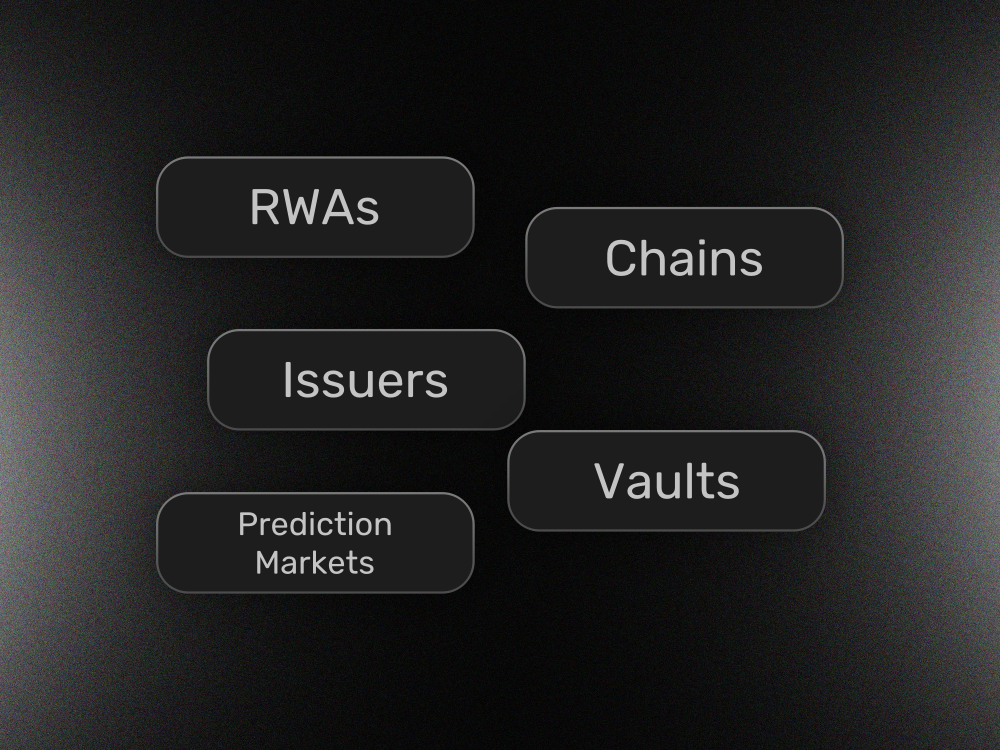

# System Overview

<h2 align="center">Meet Gearbox</h2>

### Permissionless Lending Rails for Onchain Credit

At Gearbox, we are making the transition to operating lending businesses onchain frictionless. Purpose built for institutions, asset-issuers and fintechs, our enterprise grade lending stack enables lenders to deploy no-code credit markets instantly.

After the V3.1 update, Gearbox market creation and management became permissionless. This shift is enabled by two core design choices:

### Strict role segregation

Access rights and responsibilities are programmatically enforced at the contract level. This promotes specialization among participants while limiting the power of any single role - an essential property for preserving a non-custodial user experience while still enabling flexible operations.

### Verifiable deployment

A functional Gearbox market is highly modular and consists of dozens of contracts. With V3.1, this deployment process is brought fully onchain for the first time, enabling transparent, verifiable market launches and trustless scaling across existing and future chains.

## Governance structure 

Gearbox is modular at its core, with governance roles designed to streamline operations while keeping access tightly controlled and enabling clear specialization across participants.

<table><thead><tr><th width="238.94140625">Entity</th><th width="141.1953125">Scope</th><th width="201.203125">Allowance</th><th>Affects users?</th></tr></thead><tbody><tr><td>DAO (tokenholders) <a data-mention href="/broken/pages/eSt3gZvAlH3S9bveINVd">Broken link</a></td><td>All chains</td><td>Deliver new versions Configure fee split</td><td>No</td></tr><tr><td>Instance (chain)  <a data-mention href="/broken/pages/5wuqwvNPhoX2zKSJaB7e">Broken link</a> </td><td>One chain</td><td>Whitelist price feeds</td><td>No</td></tr><tr><td>Risk Curators <a data-mention href="/broken/pages/QnbfYpgf8WK7O8lSNQHY">Broken link</a> </td><td>Owned markets</td><td>Change risk parameters</td><td>Yes Subject to timelock</td></tr></tbody></table>

<table data-view="cards"><thead><tr><th></th><th></th><th></th><th data-hidden data-card-target data-type="content-ref"></th><th data-hidden data-card-cover data-type="image">Cover image</th></tr></thead><tbody><tr><td><h4><i class="fa-toolbox">:toolbox:</i></h4></td><td><strong>Create Permissionless Markets</strong></td><td>Build onchain lending businesses on best-in-class infrastructure.</td><td><a href="/broken/pages/zprNEvdKVY4g4Id3sfKE">Broken link</a></td><td><a href=".gitbook/assets/gearboxdocscurate.png">gearboxdocscurate.png</a></td></tr><tr><td><h4><i class="fa-money-bill-transfer">:money-bill-transfer:</i></h4></td><td><strong>Lend or Borrow</strong></td><td>Learn how to make the most of curated opportunities.</td><td><a href="https://app.gitbook.com/o/dtja0dpftnVBhpMHCZ5y/s/UQ4ExmqTk5ZgqG4luwpC/">User docs</a></td><td><a href=".gitbook/assets/gearboxdocsborrow.png">gearboxdocsborrow.png</a></td></tr><tr><td><h4><i class="fa-gear-complex">:gear-complex:</i></h4></td><td><strong>Understanding Gearbox</strong></td><td>Learn about unlocking onchain credit and Gearbox Permissionless.</td><td><a href="https://app.gitbook.com/o/dtja0dpftnVBhpMHCZ5y/s/viVygst6ymEvrLTl74w1/">About Gearbox</a></td><td><a href=".gitbook/assets/gearboxdocsmain.png">gearboxdocsmain.png</a></td></tr></tbody></table>



<figure><figcaption></figcaption></figure>



### Learn more about Gearbox's unique usecases

RWAs, Vaults, Prediction Markets, Onchain Assets, No-DEX lending. Learn about the opportunities Gearbox unlocks.

<a href="/broken/pages/NnGeV01vemI7jvTkqshe" class="button primary" data-icon="book-open">Helping Mellow x P2P lrt grow 2x</a>&#x20;



