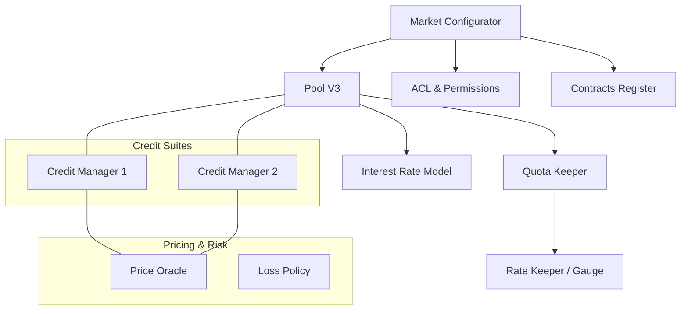

# Market

## Getting Started

New to Gearbox development? Start here:

- [Contract Discovery](getting-started/contract-discovery.md) - Find any protocol contract programmatically
- [Market Data](getting-started/market-data.md) - Query complete market state with MarketCompressor

For conceptual background, see [Credit Suite Architecture](../new-docs-about/core-architecture/credit-suite.md) in the About documentation.

---

## Market Overview

In Gearbox V3, a "Market" is a cohesive ecosystem centered around a single **Lending Pool**. Each market is governed by a **Market Configurator** and includes a suite of risk management, pricing, and credit components.



### How to Retrieve Market State

To get a complete snapshot of a market without making dozens of individual RPC calls, you should use the `MarketCompressor`. This utility contract aggregates the state of all components into a single structured response.

#### Calling the Market Compressor

You can query a specific pool or filter through multiple markets using the `IMarketCompressor` interface.

**Methods:**

* `getMarketData(address pool)`: Fetches data for a specific pool.
* `getMarkets(MarketFilter filter)`: Fetches data for multiple pools based on underlying assets or configurators.

**Example (ethers.js/viem):**

```typescript
const marketData = await marketCompressor.getMarketData(POOL_ADDRESS);
console.log(`Market for ${marketData.pool.name} is managed by ${marketData.configurator}`);
```

***

### Understanding `MarketData`

The `MarketData` struct is the comprehensive state object for a Gearbox market. Below is a breakdown of its fields and what they represent:

| Field                  | Description                                                                                 | Deep Dive                |
| ---------------------- | ------------------------------------------------------------------------------------------- | ------------------------ |
| `acl`                  | The Access Control List contract managing roles for this specific market.                   | Permissions & ACL Guide  |
| `contractsRegister`    | Registry of all active Pools and Credit Managers within this market instance.               | System Registries        |
| `treasury`             | The address (often a `TreasurySplitter`) where protocol fees are collected and distributed. | Fee & Treasury Model     |
| `pool`                 | The core lending contract.                                                                  | Pool V3 Documentation    |
| `quotaKeeper`          | Manages borrowing limits (quotas) for specific tokens within the pool.                      | Quota Management         |
| `interestRateModel`    | The mathematical model determining supply/borrow rates.                                     | Interest Rate Models     |
| `rateKeeper`           | Determines the interest rates for individual collaterals.                                   | Gauges & Rate Keeping    |
| `priceOracle`          | The routing hub for asset valuation, managing primary and reserve feeds.                    | Oracle V3 Architecture   |
| `lossPolicy`           | Safety logic determining how liquidations with bad debt are handled.                        | Risk & Loss Policies     |
| `tokens`               | A list of `TokenData` for all collateral tokens supported by this market.                   | Supported Assets         |
| `creditManagers`       | An array of all `CreditSuiteData` (Credit Managers + Facades) connected to this pool.       | Credit Suite Exploration |
| `configurator`         | The `MarketConfigurator` contract that has administrative rights over this market.          | Risk Curation            |
| `pausableAdmins`       | List of addresses authorized to pause protocol components in emergencies.                   | Emergency Procedures     |
| `unpausableAdmins`     | High-level admins authorized to resume operations.                                          | Governance Roles         |
| `emergencyLiquidators` | Authorized bots or addresses allowed to liquidate during extreme volatility.                | Liquidation Bot Guide    |

***

### Navigation Directory

Use the links below to explore the technical implementation and configuration parameters of each component found in the `MarketData` struct.

#### 1. Core Liquidity

* [**Pool V3 Deep Dive**](core/poolv3-the-liquidity-hub.md): Liquidity tracking, `dieselRate` (RAY) calculations, and the `underlying` asset logic.
* [**Interest Rate Mechanics**](core/interest-rate-model.md): Understanding slope parameters and utilization curves.

#### 2. Risk & Quotas

* [**Quota Keeper Logic**](core/pool-quota-keeper.md): How the protocol limits exposure to volatile assets and controls collateral-specific rates.

#### 3. Credit

* [**Credit Suite**](https://github.com/Gearbox-protocol/periphery-v3/blob/main/contracts/types/CreditSuiteData.sol): Understanding the relationship between Managers, Facades, Configurators.
* [**Asset Valuation (Oracles)**](https://github.com/Gearbox-protocol/periphery-v3/blob/main/contracts/compressors/PriceFeedCompressor.sol): Recursive price feed trees and staleness checks.

#### 4. Governance & Security

* [**The Permissionless Framework**](https://github.com/Gearbox-protocol/permissionless/blob/master/contracts/market/MarketConfigurator.sol): How Risk Curators deploy and upgrade market components.
* [**ACL & Roles**](https://github.com/Gearbox-protocol/permissionless/blob/master/contracts/market/ACL.sol): Detailed mapping of administrative permissions.

<details>

<summary>Sources</summary>

* [contracts/compressors/MarketCompressor.sol](https://github.com/Gearbox-protocol/periphery-v3/blob/main/contracts/compressors/MarketCompressor.sol)
* [contracts/types/MarketData.sol](https://github.com/Gearbox-protocol/periphery-v3/blob/main/contracts/types/MarketData.sol)
* [contracts/interfaces/IMarketCompressor.sol](https://github.com/Gearbox-protocol/periphery-v3/blob/main/contracts/interfaces/IMarketCompressor.sol)
* [contracts/market/MarketConfigurator.sol](https://github.com/Gearbox-protocol/permissionless/blob/master/contracts/market/MarketConfigurator.sol)
* [contracts/pool/PoolQuotaKeeperV3.sol](https://github.com/Gearbox-protocol/core-v3/blob/main/contracts/pool/PoolQuotaKeeperV3.sol)

</details>
