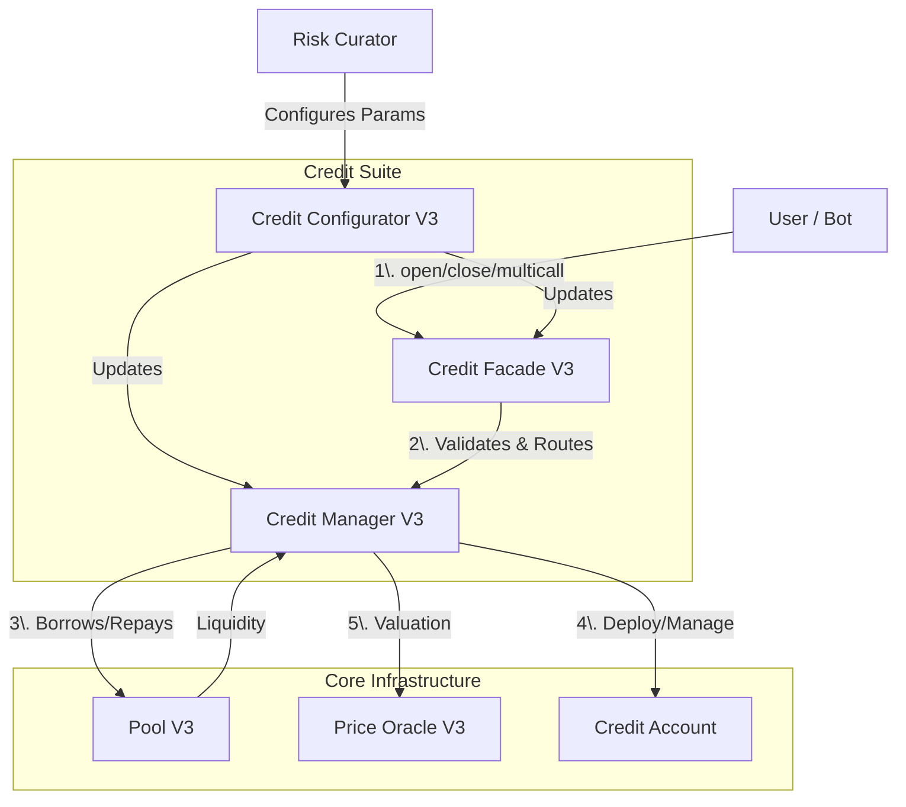

# Credit Suite

The Credit Suite is the foundational unit that enables leverage in Gearbox Protocol. It acts as an isolated environment where borrowers interact with DeFi protocols using borrowed funds while ensuring lender safety.

## Component Overview

A Credit Suite consists of three tightly coupled smart contracts deployed together:

## Credit Manager (Logic Layer)

The Credit Manager is the "brain" of the suite. It maintains the registry of Credit Accounts, connects to the underlying Pool, and calculates account solvency via the Price Oracle.

**Key Responsibilities:**

| Function           | Purpose                                                |
| ------------------ | ------------------------------------------------------ |
| Debt tracking      | Maintains total debt and collateral tokens per account |
| Pool interaction   | Borrows and repays via PoolV3                          |
| Quota management   | Coordinates with PoolQuotaKeeper for token limits      |
| Health calculation | Computes Health Factors via `calcDebtAndCollateral`    |

The Credit Manager is generally not accessed directly by users but by the Facade or Adapters.

## Credit Facade (Access Layer)

The Credit Facade is the "face" of the suite. It serves as the primary entry point for users and implements the multicall logic, allowing complex DeFi operations to happen in a single transaction.

**Key Responsibilities:**

| Function              | Purpose                                                          |
| --------------------- | ---------------------------------------------------------------- |
| Multicall execution   | Iterates through user-provided calls, routing to Credit Account  |
| Security checks       | Performs collateral check (Health Factor > 1) at transaction end |
| Permission management | Manages BotList permissions for approved bots                    |
| Access control        | Enforces minDebt, maxDebt, and forbiddenTokenMask limits         |

## Credit Configurator (Governance Layer)

The Credit Configurator provides a secure interface for Risk Curators (or the DAO) to manage the suite without direct contract upgrades.

**Key Responsibilities:**

| Function               | Purpose                           |
| ---------------------- | --------------------------------- |
| Collateral tokens      | Adding/removing allowed tokens    |
| Liquidation thresholds | Setting LT per token              |
| Adapters               | Configuring protocol integrations |
| Fees and limits        | Adjusting fee parameters          |

## Configuration Parameters

Risk Curators utilize the Credit Configurator to define the risk profile:

| Parameter                      | Description                                                             |
| ------------------------------ | ----------------------------------------------------------------------- |
| **Liquidation Threshold (LT)** | Maximum leverage for a token. LT of 8500 (85%) implies \~6.6x leverage. |
| **Collateral Tokens**          | Allowed tokens in Credit Accounts. Unlisted tokens value at 0.          |
| **Adapters**                   | Whitelisted protocol integrations (e.g., Uniswap, Curve).               |
| **Debt Limits**                | minDebt and maxDebt per account to prevent dust or concentration risk.  |
| **Fees**                       | feeLiquidation (to protocol) and liquidationPremium (to liquidator).    |

## Borrowing and Repayment Flow

### Borrowing

1. User calls CreditFacade (open account or increase debt)
2. Facade validates request against debt limits
3. Facade instructs Manager to borrow
4. Manager calls Pool.lendCreditAccount(amount, creditAccount)
5. Pool transfers underlying directly to Credit Account
6. Pool updates interest rate based on new utilization

### Repayment

1. User calls CreditFacade (close account or decrease debt)
2. Manager calculates principal + interest + quota fees
3. Underlying transfers to Pool (from user or Credit Account)
4. Manager calls Pool.repayCreditAccount
5. Pool burns treasury shares (if loss) or mints treasury shares (if profit)

## Health Factor

The Health Factor determines account solvency:

**Health Factor = Total Weighted Value / Total Debt**

* Total Weighted Value: Sum of (asset value \* liquidation threshold) for all collateral
* Total Debt: Principal + accrued interest + quota fees

When Health Factor drops below 1.0, the account becomes liquidatable.

## Implementation

For implementation details, see:

* **TypeScript/SDK:** [SDK Credit Accounts](../sdk-guide-typescript/credit-accounts.md)
* **Solidity:** [Credit Accounts](../solidity-guide/credit-accounts.md)
