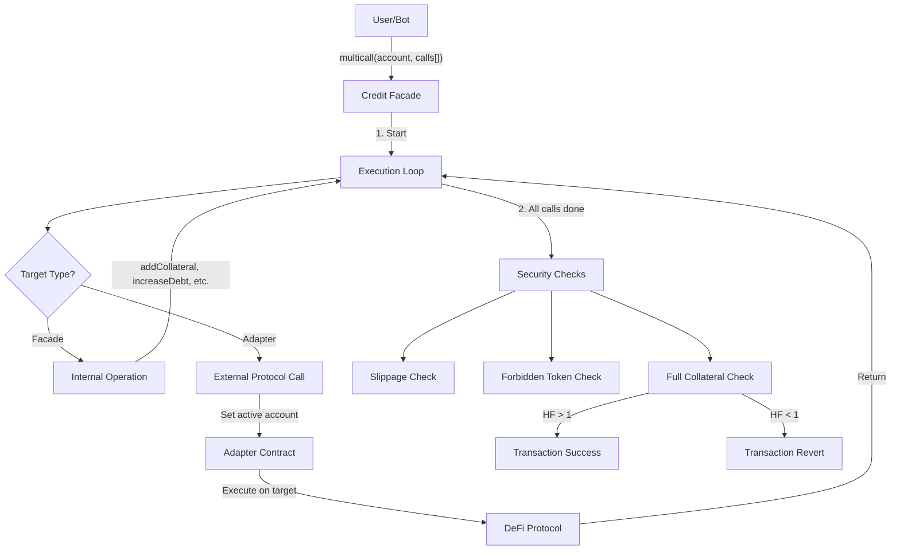

# Multicall System

The multicall system allows complex DeFi operations to execute in a single transaction. It is orchestrated by the CreditFacadeV3, with a mandatory collateral check at the end to ensure account solvency.

## The MultiCall Structure

A multicall is an array of operations, each specifying a target contract and encoded function call:

| Field | Type | Description |
|-------|------|-------------|
| `target` | `address` | CreditFacade or allowed Adapter address |
| `callData` | `bytes` | Encoded function call |

## Execution Flow

### Step-by-Step Process

1. **Start MultiCall:** Facade emits StartMultiCall event
2. **Execution Loop:** Facade iterates through calls array
   - If target is Facade: executes internal protocol logic
   - If target is Adapter: routes call to whitelisted adapter
3. **End MultiCall:** Facade unsets active account status
4. **Security Checks:**
   - Slippage verification against stored expected balances
   - Forbidden token balance checks
   - Full collateral check (Health Factor > 1)

## Available Operations

Operations available within a multicall fall into categories:

### Protocol Logic

| Operation | Purpose |
|-----------|---------|
| `addCollateral` | Move tokens from wallet to Credit Account |
| `increaseDebt` | Borrow underlying from Pool |
| `decreaseDebt` | Repay debt to Pool |
| `updateQuota` | Purchase quota for collateral token |
| `withdrawCollateral` | Remove assets from account |

### Safety Controls

| Operation | Purpose |
|-----------|---------|
| `onDemandPriceUpdates` | Push fresh price data (must be first call) |
| `storeExpectedBalances` | Record balances for slippage check |
| `compareBalances` | Trigger slippage verification |
| `setFullCheckParams` | Optimize collateral check with hints |

### External Calls

External calls go through Adapters - whitelisted contracts that translate Gearbox calls to target protocol calls. Each Credit Manager has its own set of allowed adapters.

## Multicall-Supporting Functions

All CreditFacade functions that modify state accept a multicall array:

| Function | Purpose |
|----------|---------|
| `openCreditAccount` | Create account with initial operations |
| `closeCreditAccount` | Close account, return remaining funds |
| `multicall` | Execute operations on existing account |
| `botMulticall` | Bot-initiated operations (with permissions) |
| `liquidateCreditAccount` | Liquidate unhealthy account |

This allows all account management to happen in one transaction, minimizing gas overhead by batching under a single collateral check.

## Security Mechanisms

### Slippage Protection

Use `storeExpectedBalances` before swaps and `compareBalances` after to prevent sandwich attacks. The protocol compares actual balances against expected minimums.

### Forbidden Token Handling

Some tokens may be marked "forbidden" - their balances cannot increase during a multicall. The Facade checks forbidden token balances before and after execution.

### Collateral Check

Every multicall (except close/liquidate) ends with a collateral check:

- Total Weighted Value must exceed Total Debt
- Health Factor = TWV / Debt must be > 1.0
- Failed check reverts the entire transaction

## The "Diff" Pattern

Adapters implement `*_diff` functions (e.g., `swapDiff`, `depositDiff`) for handling unknown amounts. Instead of specifying exact input amounts:

- Standard: needs exact `amountIn`
- Diff: calculates `amountIn = currentBalance - leftoverAmount`

This is essential when the exact result of a previous operation is unknown.

## Bot Permissions

Multicalls enforce granular permissions via bitmask:

| Permission | Purpose |
|------------|---------|
| `ADD_COLLATERAL` | Move funds into account |
| `INCREASE_DEBT` | Borrow more from pool |
| `UPDATE_QUOTA` | Modify quota settings |
| `EXTERNAL_CALLS` | Call external adapters |
| `WITHDRAW_COLLATERAL` | Remove funds from account |

A user can delegate specific permissions to bots while protecting against unauthorized withdrawals.

## Best Practices

1. **Price updates first:** Always put `onDemandPriceUpdates` at the start if using pull-based oracles
2. **Slippage protection:** Always use `storeExpectedBalances` when performing swaps
3. **Dust management:** Use `type(uint256).max` in `withdrawCollateral` to empty balances (subtracts 1 wei automatically)
4. **Gas optimization:** Use `setFullCheckParams` with hints for accounts with many tokens

## Implementation

For implementation details, see:

- **TypeScript/SDK:** [SDK Multicalls](../sdk-guide/multicalls.md)
- **Solidity:** [Solidity Multicalls](../solidity-guide/multicalls.md)
