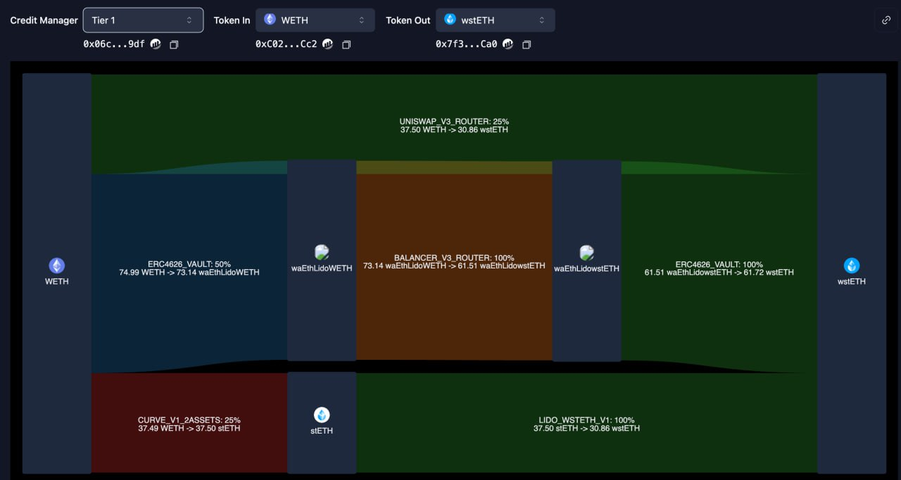

# Versatile collateral support

Gearbox approaches the challenge of supporting a broad range of on-chain collateral from two equally important perspectives: execution and pricing.

* Execution focuses on providing a simple, intuitive UX while users operate complex DeFi positions with credit.
* Pricing addresses the fact that different assets rely on distinct valuation mechanisms, each with unique price dynamics that directly impact risk management.

## Execution

Execution is optimized through adapters — modular integrations that connect external protocols directly into the credit engine.

The up-to-date list of allowed adapters is maintained in the curators’ documentation.



To be eligible for use, an adapter must:

* Be audited at least once
* Be signed on-chain in the Bytecode Repository by a whitelisted auditor

Gearbox’s in-house Router automatically aggregates execution paths enabled by approved adapters and composes multicall transactions, which are executed atomically by Credit Accounts.

<figure><figcaption>
Example router output 
</figcaption></figure>

## Pricing

> While oracle providers continue to expand asset coverage, meaningful limitations remain:
>
> * Oracles from major providers are expensive for asset issuers, often delaying asset launches
> * Emerging assets or chain-local DeFi tokens may not be supported at all

Gearbox works with a wide range of oracle models, including major push-based providers such as Chainlink, Redstone, and other AggregatorV3Interface oracles and on-demand pull-based pricing via Pyth and Redstone.

More details on the differences between push and pull price feeds can be found in the Redstone blog.



In addition, Gearbox supports a diverse set of modular smart-contract price feeds that are audited and approved for permissionless deployment. These feeds streamline pricing for standardized assets such as Curve LP tokens, ERC-4626 vaults, Pendle PTs, Tokens with bounded or formula-based prices and more.

The current list of allowed smart-contract feeds is available in the curators’ documentation.


