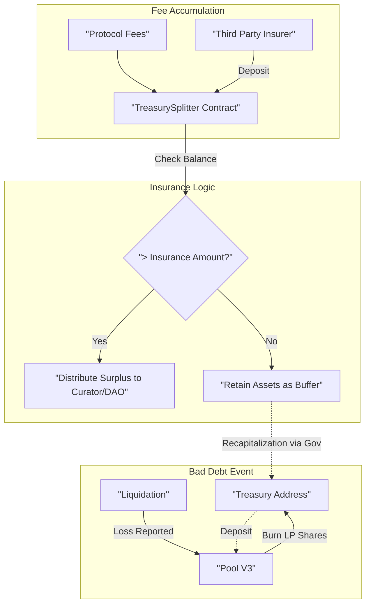

# Automated Insurance mechanism

The insurance mechanism in Gearbox V3 functions as a **liquidity buffer** held in the `TreasurySplitter` contract. It acts as a first-loss protection layer to maintain pool solvency during bad debt events.

## How the Insurance Mechanism Works

The "Insurance" is essentially a **retention policy** on the fees collected by the protocol. Instead of immediately distributing all profits to the Curator and the DAO, the `TreasurySplitter` holds a specific amount of tokens back as a safety buffer.

**The Buffer Logic (`TreasurySplitter`)**

The `TreasurySplitter` collects fees (from interest and standard liquidations). Before any of these fees can be claimed (distributed) by the admins, the contract checks if the current balance exceeds the `tokenInsuranceAmount`.

* **If Balance < Insurance Amount:** The distribution fails/stops. All funds remain in the contract.
* **If Balance > Insurance Amount:** Only the surplus (`balance - insuranceAmount`) is distributed. The `insuranceAmount` remains locked in the contract.

This ensures that there is always a pile of liquid assets available to the protocol to cover unexpected losses before any profit-taking occurs.

***

#### Understanding the Flow (Architecture)

The following diagram shows how the assets are held and how the distribution logic protects the insurance amount:



***

## Covering Bad Debt (Liquidation Logic)

When a "Bad Debt" liquidation occurs (where the collateral value is less than the debt), the system must cover the deficit to keep the lenders whole. This happens in the `PoolV3` contract, interacting with the protocol's Treasury balance.

1. **Liquidation with Loss:** A liquidator calls `liquidateCreditAccount`. They sell the collateral, but the proceeds are insufficient to repay the full debt.
2. **Reporting the Loss:** The Credit Manager calls `pool.repayCreditAccount(..., profit, loss)`.
3. **Burning the Buffer:** The Pool burns **LP Shares** held by the Treasury address to cover the loss.

**Critical Link:** The `TreasurySplitter` accumulates the _pool's LP tokens_. The assets held in the `TreasurySplitter` can be used to **re-deposit** into the Pool effectively using the insurance buffer to pay for the bad debt.

***

> For the economic model behind insurance reserves and first-loss capital mechanics, see [Insurance and Solvency Reserves](../../new-docs-about/economics-and-risk/insurance-and-solvency-reserves.md).

***

## Reading Insurance State On-Chain

Query the `TreasurySplitter` contract to verify insurance health for a specific pool.

### 1. Check Insurance Target (The Floor)

The minimum amount retained before any profit distribution:

#### Solidity

```solidity
uint256 target = treasurySplitter.tokenInsuranceAmount(token);
```

#### TypeScript

```typescript
import { getContract } from 'viem';
import { iTreasurySplitterAbi } from '@gearbox-protocol/sdk';

const treasurySplitter = getContract({
  address: treasurySplitterAddress,
  abi: iTreasurySplitterAbi,
  client: publicClient
});

const insuranceTarget = await treasurySplitter.read.tokenInsuranceAmount([tokenAddress]);
```

### 2. Check Current Buffer

Compare actual balance to target to determine insurance status:

#### Solidity

```solidity
uint256 target = treasurySplitter.tokenInsuranceAmount(token);
uint256 balance = IERC20(token).balanceOf(address(treasurySplitter));

bool fullyInsured = balance >= target;
uint256 surplus = balance > target ? balance - target : 0;
```

#### TypeScript

```typescript
import { erc20Abi } from 'viem';

// Get target and current balance
const target = await treasurySplitter.read.tokenInsuranceAmount([tokenAddress]);
const balance = await publicClient.readContract({
  address: tokenAddress,
  abi: erc20Abi,
  functionName: 'balanceOf',
  args: [treasurySplitterAddress]
});

const fullyInsured = balance >= target;
const surplus = balance > target ? balance - target : 0n;
```

### 3. Monitor Governance Changes

Insurance parameter changes require dual signatures (Curator + DAO):

#### TypeScript

```typescript
// Get pending proposals that may affect insurance
const proposals = await treasurySplitter.read.activeProposals();

// Each proposal contains: proposer, target, calldata, executed status
for (const proposal of proposals) {
  console.log('Pending proposal:', proposal);
}
```

### 4. Query Fee Distribution Config

Understand where surplus fees are distributed:

#### TypeScript

```typescript
// Get default split configuration
const defaultSplit = await treasurySplitter.read.defaultSplit();

// Or token-specific split
const tokenSplit = await treasurySplitter.read.tokenSplits([tokenAddress]);

// Returns: { receivers: address[], proportions: uint256[] }
```

<details>

<summary>Sources</summary>

* [contracts/market/TreasurySplitter.sol](https://github.com/Gearbox-protocol/permissionless/blob/master/contracts/market/TreasurySplitter.sol)
* [contracts/interfaces/ITreasurySplitter.sol](https://github.com/Gearbox-protocol/permissionless/blob/master/contracts/interfaces/ITreasurySplitter.sol)
* [contracts/credit/CreditManagerV3.sol](https://github.com/Gearbox-protocol/core-v3/blob/main/contracts/credit/CreditManagerV3.sol)

</details>
