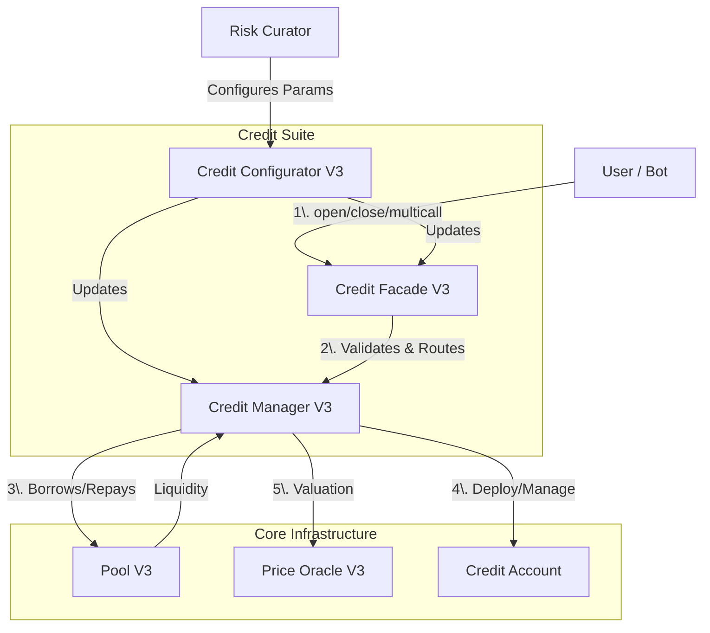

# Credit Suite

In Gearbox Protocol V3, the **Credit Suite** is the foundational unit that enables leverage. It acts as an isolated environment where borrowers can interact with DeFi protocols using borrowed funds while ensuring the safety of the liquidity providers.

A Credit Suite consists of three tightly coupled smart contracts deployed together:

1. **Credit Manager (Logic Layer):** The core engine managing debt, collateral, and risk.
2. **Credit Facade (Access Layer):** The user entry point ensuring security and executing multicalls.
3. **Credit Configurator (Governance Layer):** The interface for Risk Curators to adjust parameters.

### Component Overview



## Credit Manager V3

The **Credit Manager** is the "brain" of the suite. It maintains the registry of Credit Accounts, connects to the underlying Pool, and connects to the Price Oracle to calculate account solvency. It is generally not accessed directly by users but by the Facade or Adapters.

* **Key Responsibilities:**
  * Tracking total debt and collateral tokens.
  * Interacting with the `PoolV3` to borrow or repay funds.
  * Managing the `PoolQuotaKeeper` for token-specific borrowing limits.
  * Calculating Health Factors and thresholds via `calcDebtAndCollateral`.

> For quota economics and how they affect borrowing costs, see [Quota Controls](../../new-docs-about/economics-and-risk/quota-controls.md).

## Credit Facade V3

The **Credit Facade** is the "face" of the suite. It is the primary entry point for users and implements the `multicall` logic, allowing complex DeFi operations (e.g., swap, add collateral, deposit to Yearn) to happen in a single transaction.

* **Key Responsibilities:**
  * **Multicall Execution:** Iterates through user-provided calls, routing them to the Credit Account.
  * **Security Checks:** Performs the final collateral check (Health Factor > 1) at the end of a transaction to prevent bad debt.
  * **Permissions:** Manages `BotListV3` permissions, allowing approved bots to manage accounts.
  * **Access Control:** Enforces limits like `minDebt`, `maxDebt`, and `forbiddenTokenMask`.

## Credit Configurator V3

The **Credit Configurator** provides a secure interface for **Risk Curators** (or the DAO) to manage the suite without needing direct upgrades to the core logic.

* **Key Responsibilities:**
  * Adding/Removing collateral tokens.
  * Setting Liquidation Thresholds (LT).
  * Configuring adapters (e.g., Uniswap, Curve).
  * Adjusting fees and limits.

***

## Interaction with the Pool

The Credit Suite is attached to a specific **Pool V3** (e.g., a USDC Pool or ETH Pool). The interaction is strictly defined to ensure solvency.

#### Borrowing Flow

1. User calls `CreditFacade.openCreditAccount` or `increaseDebt`.
2. Facade validates the request against `debtLimits`.
3. Facade instructs Manager to borrow.
4. Manager calls `PoolV3.lendCreditAccount(borrowedAmount, creditAccount)`.
5. **Pool** transfers the underlying asset directly to the **Credit Account**.
6. Pool updates the interest rate model based on the new utilization.

**Opening a Credit Account (Solidity):**

```solidity
// ICreditFacadeV3.sol
function openCreditAccount(
    address onBehalfOf,
    MultiCall[] calldata calls,
    uint256 referralCode
) external payable returns (address creditAccount);
```

**Opening a Credit Account (TypeScript with SDK):**

```typescript
import { GearboxSDK, createCreditAccountService } from '@gearbox-protocol/sdk';

// Initialize SDK (see getting-started/sdk-setup.md)
const sdk = await GearboxSDK.attach({ client, marketConfigurators: [] });

// Find market by credit manager
const market = sdk.marketRegister.findByCreditManager(cmAddress);
const creditFacade = market.creditFacade;

// Create service for account operations
const service = createCreditAccountService(sdk, 310);

// Build multicall with SDK helpers
const calls = [
  service.prepareAddCollateral(usdcAddress, 10000n * 10n ** 6n),
  service.prepareIncreaseDebt(40000n * 10n ** 6n),
];

// Open account
const hash = await creditFacade.write.openCreditAccount([
  ownerAddress,
  calls,
  0n, // referralCode
]);
```

**Opening a Credit Account (TypeScript with raw viem):**

```typescript
import { encodeFunctionData } from 'viem';

// Build multicall array for initial operations
const calls: MultiCall[] = [
  {
    target: creditFacade,
    callData: encodeFunctionData({
      abi: creditFacadeMulticallAbi,
      functionName: 'addCollateral',
      args: [usdcAddress, 10000n * 10n ** 6n], // 10,000 USDC
    }),
  },
  {
    target: creditFacade,
    callData: encodeFunctionData({
      abi: creditFacadeMulticallAbi,
      functionName: 'increaseDebt',
      args: [40000n * 10n ** 6n], // Borrow 40,000 USDC
    }),
  },
];

// Open account with initial operations
const hash = await creditFacade.write.openCreditAccount([
  ownerAddress,  // onBehalfOf
  calls,         // initial multicall
  0n,            // referralCode
]);
```

#### Repayment Flow

1. User calls `CreditFacade.closeCreditAccount` or `decreaseDebt`.
2. Manager calculates the principal + interest + quota fees owed.
3. The User (or the Credit Account during a swap) transfers the underlying asset to the Pool.
4. Manager calls `PoolV3.repayCreditAccount`.
5. **Pool** burns treasury shares if a loss occurred (bad debt) or mints treasury shares if a profit (fees) was generated.

***

### Curator Configuration

Risk Curators utilize the `CreditConfigurator` to define the risk profile of the Credit Suite. These parameters determine how much leverage is allowed and which assets can be traded.

| Parameter                      | Description                                                                                                                                                      |
| ------------------------------ | ---------------------------------------------------------------------------------------------------------------------------------------------------------------- |
| **Liquidation Threshold (LT)** | Defines the maximum leverage for a specific token. An LT of 8500 (85%) implies \~6.6x leverage. Higher volatility assets typically have lower LTs.               |
| **Collateral Tokens**          | The list of tokens allowed to be held in a Credit Account. If a token is not added, the oracle will not price it, effectively valuing it at 0.                   |
| **Adapters**                   | Smart contracts connecting Gearbox to external protocols (e.g., Uniswap V3 Adapter). Curators must allow specific adapters to enable trading/farming strategies. |
| **Debt Limits**                | `minDebt` and `maxDebt` per account to prevent dust attacks or excessive concentration risk.                                                                     |
| **Fees**                       | `feeLiquidation` (paid to protocol) and `liquidationPremium` (paid to liquidator) incentivize third parties to keep the pool solvent.                            |

***

### Data Fetching Flow for Integrators

To build a frontend or a bot for Gearbox V3, you need to fetch configuration and runtime data from the Credit Suite.

#### Using the SDK (Recommended)

```typescript
import { GearboxSDK, createCreditAccountService } from '@gearbox-protocol/sdk';

const sdk = await GearboxSDK.attach({ client, marketConfigurators: [] });
const service = createCreditAccountService(sdk, 310);

// Get all credit accounts for a credit manager
const accounts = await service.getCreditAccounts(
  { creditManager: cmAddress },
  sdk.currentBlock
);

// Access market data
const market = sdk.marketRegister.findByCreditManager(cmAddress);
const pool = market.pool;
const creditFacade = market.creditFacade;

// Get account details
for (const account of accounts) {
  console.log(`Account: ${account.addr}`);
  console.log(`  Owner: ${account.owner}`);
  console.log(`  Debt: ${account.debt}`);
  console.log(`  Health Factor: ${account.healthFactor}`);
}
```

> For compressor-level access with custom filtering, see [Compressors](./compressors.md).

#### Fetching Account State

Use `calcDebtAndCollateral` on the **Credit Manager**. This is the most critical function for determining solvency.

```solidity
// From ICreditManagerV3.sol

enum CollateralCalcTask {
    GENERIC_PARAMS, // Basic info (debt, cumulative index)
    DEBT_ONLY,      // Detailed debt (base interest + quota interest)
    FULL_COLLATERAL_CHECK_LAZY, // Internal use
    DEBT_COLLATERAL, // Full debt + Total Value (used for Health Factor)
    DEBT_COLLATERAL_SAFE_PRICES // Uses safe pricing (Min(Chainlink, Reserve))
}

function calcDebtAndCollateral(
    address creditAccount,
    CollateralCalcTask task
) external view returns (CollateralDebtData memory cdd);
```

```typescript
// TypeScript/viem equivalent
import { getContract } from 'viem';

const creditManager = getContract({
  address: creditManagerAddress,
  abi: creditManagerAbi,
  client: publicClient,
});

// CollateralCalcTask enum values
const CollateralCalcTask = {
  GENERIC_PARAMS: 0,
  DEBT_ONLY: 1,
  FULL_COLLATERAL_CHECK_LAZY: 2,
  DEBT_COLLATERAL: 3,
  DEBT_COLLATERAL_SAFE_PRICES: 4,
} as const;

// Fetch account state for health factor calculation
const cdd = await creditManager.read.calcDebtAndCollateral([
  creditAccount,
  CollateralCalcTask.DEBT_COLLATERAL,
]);

// Calculate health factor (10000 = 100% = HF of 1.0)
const healthFactor = (cdd.twvUSD * 10000n) / cdd.totalDebtUSD;
```

**Calculation:**

* **Health Factor** = `cdd.twvUSD` (Total Weighted Value) / `cdd.totalDebtUSD`.
* If `Health Factor < 1`, the account is liquidatable.

> For the conceptual foundation of Health Factor and liquidation mechanics, see [Liquidation Dynamics](../../new-docs-about/economics-and-risk/liquidation-dynamics/).

#### 3. Fetching Configuration

Retrieve parameters to understand the rules of the suite.

**From Credit Facade:**

* `debtLimits()`: Returns `minDebt` and `maxDebt`.
* `forbiddenTokenMask()`: Returns a bitmask of tokens currently forbidden (cannot increase position).

**From Credit Manager:**

* `collateralTokensCount()` and `collateralTokenByMask(mask)`: Iterate to get all allowed tokens.
* `liquidationThresholds(token)`: Get the LT for a specific token.
* `fees()`: Retrieve interest, liquidation, and expiration fees.

```typescript
// TypeScript: Fetching configuration
const [minDebt, maxDebt] = await creditFacade.read.debtLimits();
const forbiddenMask = await creditFacade.read.forbiddenTokenMask();

// Get liquidation threshold for a specific token
const lt = await creditManager.read.liquidationThresholds([tokenAddress]);

// Fetch fee configuration
const fees = await creditManager.read.fees();
// fees returns: (feeInterest, feeLiquidation, liquidationPremium, feeLiquidationExpired, liquidationPremiumExpired)
```

<details>

<summary>Sources</summary>

* [contracts/credit/CreditManagerV3.sol](https://github.com/Gearbox-protocol/core-v3/blob/main/contracts/credit/CreditManagerV3.sol)
* [contracts/credit/CreditFacadeV3.sol](https://github.com/Gearbox-protocol/core-v3/blob/main/contracts/credit/CreditFacadeV3.sol)
* [contracts/credit/CreditConfiguratorV3.sol](https://github.com/Gearbox-protocol/core-v3/blob/main/contracts/credit/CreditConfiguratorV3.sol)
* [contracts/pool/PoolV3.sol](https://github.com/Gearbox-protocol/core-v3/blob/main/contracts/pool/PoolV3.sol)
* [contracts/interfaces/ICreditManagerV3.sol](https://github.com/Gearbox-protocol/core-v3/blob/main/contracts/interfaces/ICreditManagerV3.sol)

</details>
