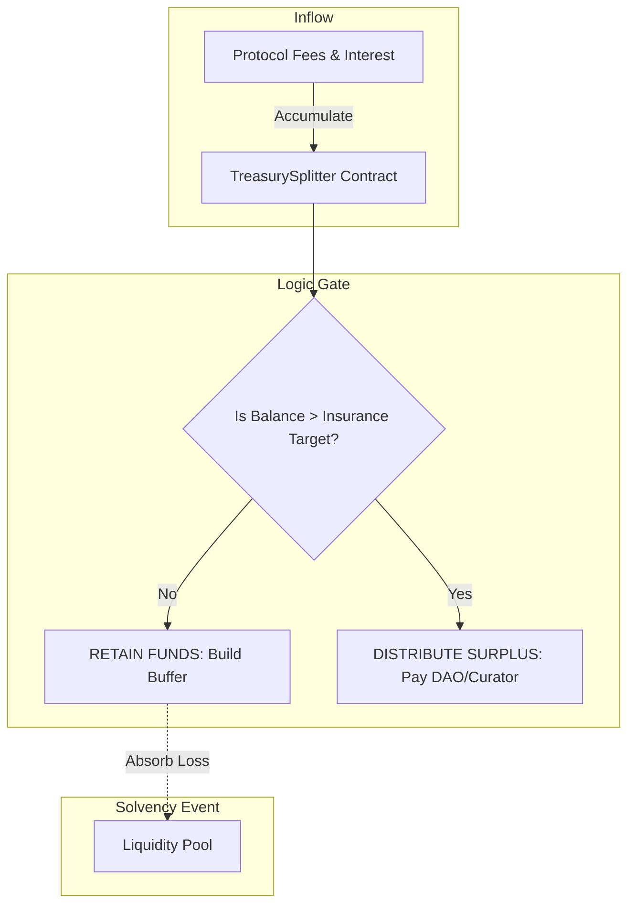

# Insurance & Solvency Reserves

The Gearbox Protocol employs an automated, on-chain reserve system designed to absorb bad debt and protect Passive Lenders. This mechanism functions not as an external insurance policy, but as a **retention buffer** on protocol revenue.

Its primary objective is to ensure that the Liquidity Pool remains solvent even if a borrower's position is liquidated below the value of their debt.

### Conceptual Overview

In traditional finance, this is analogous to a "First-Loss Capital" tranche.

The protocol generates revenue through interest rates and liquidation fees. Rather than distributing 100% of this revenue to the DAO or Market Curators immediately, the system enforces a **mandatory savings threshold**.

1. **Revenue Accumulation:** All protocol fees flow into a specific contract (`TreasurySplitter`).
2. **The Safety Floor:** A target insurance amount is defined (e.g., 100,000 USDC).
3. **Conditional Distribution:**
   * **Below Target:** If reserves are below the target, **100% of revenue is retained**. No profit is distributed.
   * **Above Target:** Only the _excess_ revenue (surplus) is distributed to the DAO and Curators.

This ensures the protocol prioritizes solvency over profit extraction.

***

### Architecture: The Treasury Splitter

The core component governing this logic is the `TreasurySplitter` contract. It acts as a gatekeeper between protocol fees and profit recipients.

#### The Distribution Logic

The `TreasurySplitter` holds assets (typically LP tokens of the pool it protects). When a distribution is attempted, the contract performs a logic check against the `tokenInsuranceAmount`.

#### The Asset Composition

The Insurance Fund does not sit idle. It is typically held in **LP Shares** (Diesel Tokens) of the pool it insures. This aligns the Treasury's interests with the Lenders' interests and allows the insurance capital to earn yield while waiting to be used.

***

### Bad Debt Coverage Mechanism

"Bad Debt" occurs when a Credit Account is liquidated, but the collateral value is insufficient to repay the debt to the pool. Without insurance, this loss would be socialized among all Lenders (reducing the value of their LP tokens).

The Insurance mechanism intervenes to prevent this socialization.

#### The Coverage Flow

1. **Liquidation Event:** A liquidator closes a non-solvent Credit Account. The remaining collateral is sold, but a deficit remains (e.g., Debt: 100k, Collateral Value: 98k, Deficit: 2k).
2. **Loss Recognition:** The Credit Manager reports the loss to the Pool.
3. **Treasury Absorption:** The Pool burns **LP Shares held by the Treasury** equal to the value of the loss.

By burning the Treasury's shares, the total supply of LP shares decreases, while the underlying assets in the pool remain (mostly) constant relative to the remaining Lenders. The Treasury effectively "pays" for the loss by giving up its claim on the pool's liquidity.

***

### On-Chain Verification

Market participants can verify the solvency health of a pool by querying the `TreasurySplitter` contract directly.

#### 1. Verify the Insurance Target (The Floor)

To determine the minimum safety buffer the protocol enforces:

* **Function:** `tokenInsuranceAmount(address token)`
* **Interpretation:** This is the "water level." The protocol will not allow profit-taking if reserves drop below this value.

#### 2. Verify Current Reserves (The Buffer)

To determine the actual capital available to absorb losses:

* **Function:** `IERC20(token).balanceOf(address treasurySplitter)`
* **Interpretation:**
  * If `Balance > InsuranceAmount`: The pool is fully insured and generating surplus.
  * If `Balance < InsuranceAmount`: The pool is building reserves; all fees are currently being retained to increase safety.

#### 3. Monitor Governance Changes

Changes to insurance parameters require a dual-signature process (Curator + DAO).

* **Function:** `activeProposals()`
* **Interpretation:** Returns pending changes to the insurance floor or distribution logic. This allows Lenders to see if a Curator is attempting to lower safety parameters.

***

## Treasury-insured pools


By default, all fees that the DAO receives from the protocol are made in dTokens. However, DAO can manage this by unwrapping part of the funds from the pools (thus, instead of dTokens, DAO will receive the usual underlying asset of the pool aka idle assets).&#x20;

This way, the DAO can limit its earnings from the Reserve Fund exposure.


Essentially, the Gearbox dTokens inside this Fee Guard are the Insurance Fund. Anything that is not in dTokens has likely been voted to be unwrapped and kept as non Insurance Fund. Any non-dTokens are not counted towards the Insurance Fund size. And this only applies to V3 contracts.

> [https://debank.com/profile/0x3e965117a51186e41c2bb58b729a1e518a715e5f](https://debank.com/profile/0x3e965117a51186e41c2bb58b729a1e518a715e5f)
>
> This address holds all the fees accumulated. However, on the topic of the Reserve Fund, only look at the balances of dTokens. No other assets are relevant to the Reserve Fund.&#x20;


This Reserve Fund model doesn't relate to actual software hacks. It specifically covers cases of under-collateralization during liquidations.


### Learn more

[Automated Insurance mechanism](https://app.gitbook.com/s/Qwh9UHWSsUkHGXmzsViV/core/automated-insurance-mechanism "mention")
