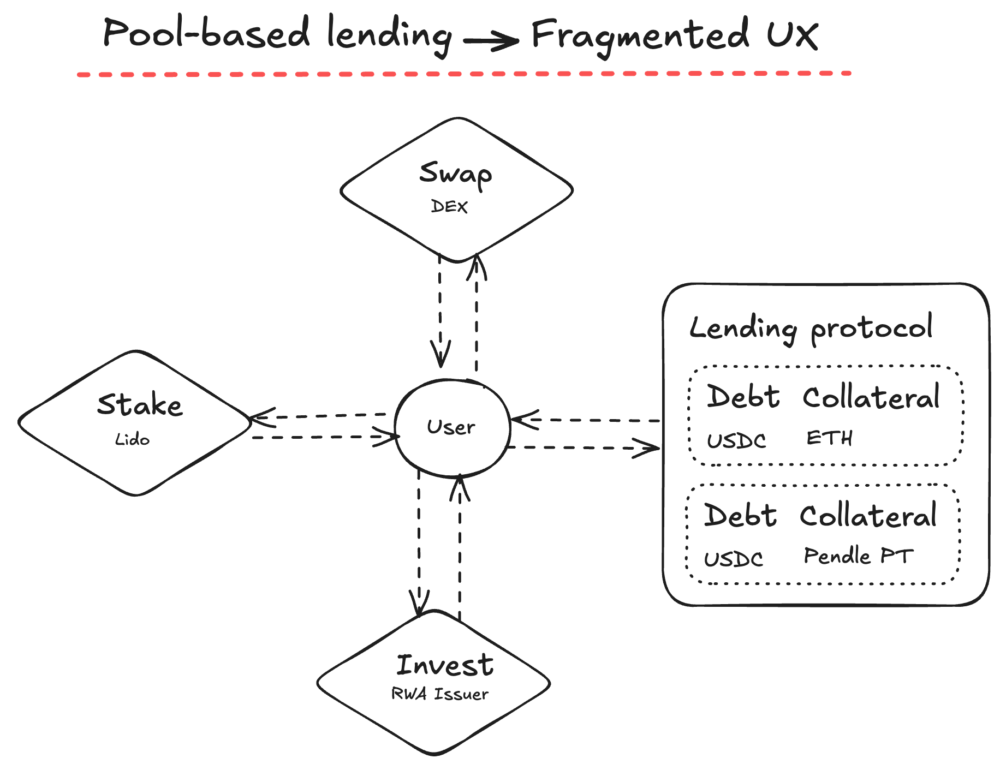
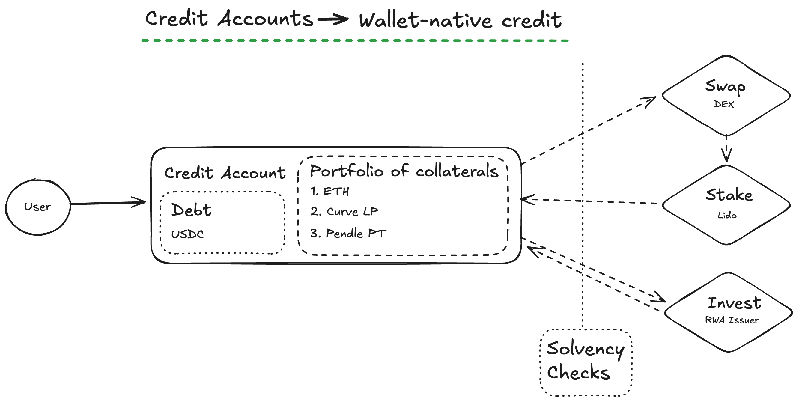

[MODE=BALANCED]

# Credit Accounts

## What is a Credit Account?
A Credit Account is user-owned smart-contract wallet, not a slice of a shared vault. Users add assets to unlock a credit line and use that account to trade, invest, or stake across integrated protocols while keeping ownership and portability. The protocol checks solvency on every move so risk stays controlled.

## What Credit Accounts enable?
- **Wider reach to users for apps and institutions:** Complex multi-transaction operations gate non-professional users. Credit accounts abstract execution by batching multiple onchain actions into single transaction, allowing to focus on effective use of capital.

- **Fees and time saving for investors:** Direct redemptions of semi-liquid tokens preserve months of yield, and batched transactions via multicall cut gas cost.  

- **Largest set of supported collaterals:** staking redemption receipts or Convex-staked positions become usable in a non-custodial, programmable account instead of being limited to prime broker clients.

## How it works
### Pool-based lending
Traditional lending protocols silo users' funds in protocol-global pools, limiting capabilities to actively operate with collateral.

### Credit Accounts
By putting collateral, debt, and execution routes inside a single smart contract wallet, users keep ownership while moving through swaps, farming, or RWA flows without repacking positions. Solvency checks sit behind every action so convenience stays aligned with risk discipline.

