# Prime Brokerage for RWA Leverage

How Gearbox enables credit products to offer leveraged positions on assets with non-atomic settlement — using ACRED as an example.

***

#### The Problem

RWAs like tokenized securities don't settle instantly. When you deposit USDC to mint ACRED, there's a delay before you receive the token. When you redeem ACRED, there's a delay before you get your USDC back.

This breaks traditional leverage flows:

**Traditional approach (flash loan style):**

1. User has $100, borrows $400 more in a flash loan
2. Swap $500 into asset
3. Deposit as collateral, receive leveraged position
4. All in one atomic transaction

**Why it fails for RWAs:**

* Step 2 doesn't work: you can't "swap" into an RWA — you must deposit and wait
* During the wait, you have no ERC20 collateral, just a pending-deposit claim
* It's technically hard to collateralize pending-deposit tokens, since those positions contain more data than a simple ERC20

**Result:** No leverage on RWAs with non-atomic settlement.

***

#### The Solution: Prime Brokerage Model

Gearbox acts as a **prime brokerage layer** that holds positions during transition phases — when assets are not yet standard ERC20s but pending deposits or redemption receipts.

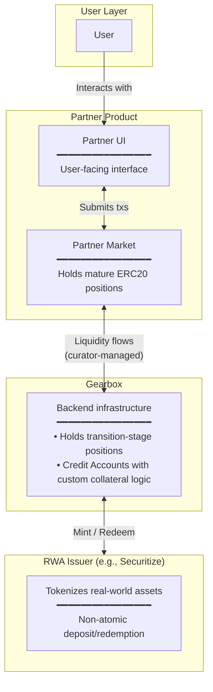

**What happens:**

* User interacts only with **Partner UI** — familiar interface
* **Partner Market** holds positions when collateral is mature ERC20
* **Gearbox** holds positions during transition (pending deposits, redemption receipts)
* **Curator** moves liquidity between Partner Market and Gearbox as positions mature

**Result:** Platforms like Morpho, Euler, and Aave can offer leveraged RWA products without modifying their core architecture.

**Position Lifecycle**

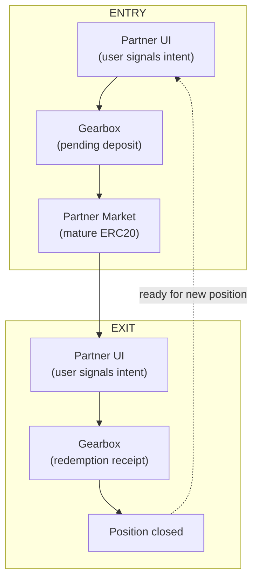

***

#### Actors & Contracts

| Actor                      | Role                                                                                                                              | Contracts                                           |
| -------------------------- | --------------------------------------------------------------------------------------------------------------------------------- | --------------------------------------------------- |
| **User**                   | Borrower taking leveraged position                                                                                                | User wallet                                         |
| **Partner Market Curator** | Capital allocator. Manages liquidity allocation between Partner vaults and Gearbox pool. Takes lending-side risk.                 | Aave hub, Euler vault, Partner vault                |
| **Gearbox Curator**        | Configures collateral types including transition-stage assets. Sets risk parameters for pending deposits and redemption receipts. | Credit Configurator                                 |
| **Partner Market**         | Lending infrastructure for mature ERC20 positions                                                                                 | Aave pool, Euler market, Partner market             |
| **Partner Vault**          | Liquidity source. Holds capital allocated by curators.                                                                            | Aave pool, Euler vault, Partner vault               |
| **Gearbox**                | Transitional venue. Holds positions during deposit/redemption windows.                                                            | Pool, Credit Manager, Credit Facade, Credit Account |
| **Securitize**             | ACRED issuer. Handles mint and redeem operations.                                                                                 | ACRED token, mint contract, redeem contract         |

**Curator Relationship**

Partner Market curators and Gearbox curators are **formally different roles** but can be the same entity. A single party may:

* Configure the Partner Vault and allocate to Gearbox
* Configure the Gearbox market for transition-stage collateral

This alignment simplifies risk management and capital efficiency.

***

#### One-Time Setup

Before users can take leveraged ACRED positions, curators configure both sides:

**Partner Market Curator**

1. **Create vault/market** for ACRED leverage product
2. **Allocate capital** to ACRED market (exposed to ERC20 RWA itself)

**Gearbox Curator**

1. **Create Gearbox market** supporting ACRED in transition state as collateral
2. **Allocate capital to Gearbox market** when there is a user intent to enter/exit position

***

#### Entry Flow: Taking 5x Leverage on ACRED

User wants $500 ACRED exposure with $100 own capital.

**Phase 1: User Intent**

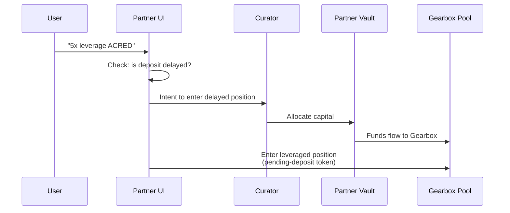

* User interacts with Partner UI (familiar interface)
* Submits intent: "5x leverage on ACRED"
* IF deposit is delayed, curator allocates capital from their vault to Gearbox pool
* User enters leveraged position in pending-deposit token

**Phase 2: Transition Setup (Gearbox + Securitize contracts)**

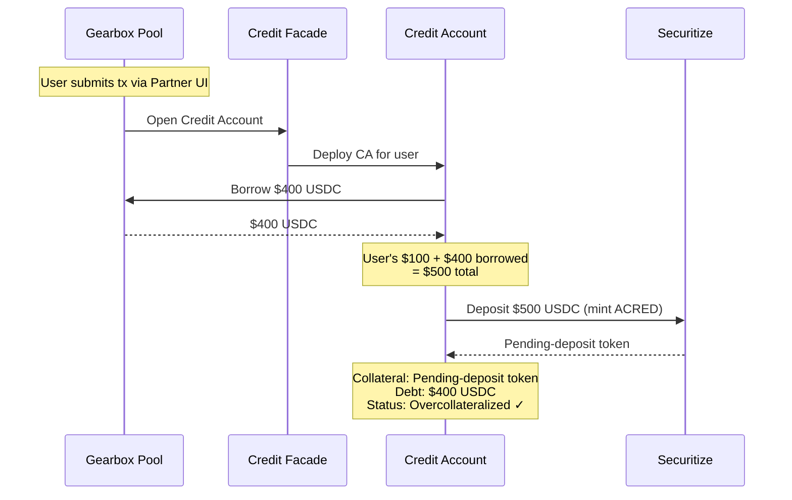

* **Credit Account deployed** for user (transparent, user doesn't interact directly)
* **Borrow $400 USDC** from Gearbox pool (capital provided by Partner Vault)
* **Deposit $500 USDC** to Securitize → receive pending-deposit token
* **Position:** Pending-deposit token (collateral) + $400 USDC debt
* **Overcollateralized** because Gearbox curator configured pending-deposit as valid collateral

**Phase 3: Waiting**

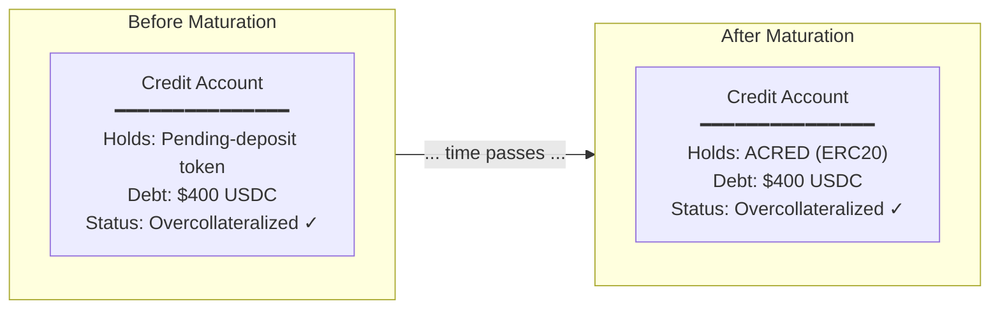

* Deposit window passes (hours to days depending on ACRED terms)
* Pending-deposit token becomes ACRED
* Position still on Gearbox Credit Account

**Phase 4: Migration to Partner Market (Partner + Gearbox contracts)**

User triggers migration (manual or auto-opt-in):

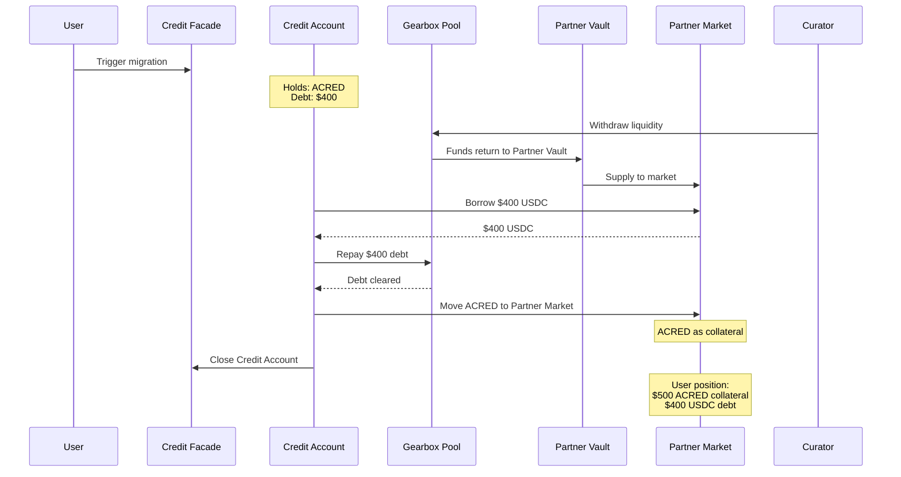

* **Curator withdraws** liquidity from Gearbox → Partner Vault
* **Partner Vault supplies** to market
* **Borrow $400 USDC** from Partner Market
* **Repay Gearbox debt** with borrowed USDC
* **Move ACRED** to Partner Market as collateral
* **Close Credit Account**

**Result:** User has overcollateralized ACRED position on Partner Market. $500 ACRED collateral, $400 USDC debt.

***

#### Exit Flow: Redeeming ACRED Position

User wants to exit $500 ACRED leveraged position ($100 equity, $400 debt) and receive USDC.

**Phase 1: User Intent**

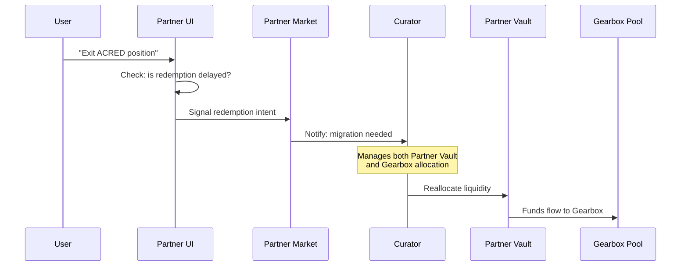

* User interacts with Partner UI (familiar interface)
* Submits intent: "Exit ACRED position"
* IF redemption is delayed, curator reallocates capital from Partner Vault to Gearbox pool

**Phase 2: Transition Setup (Gearbox + Securitize contracts)**

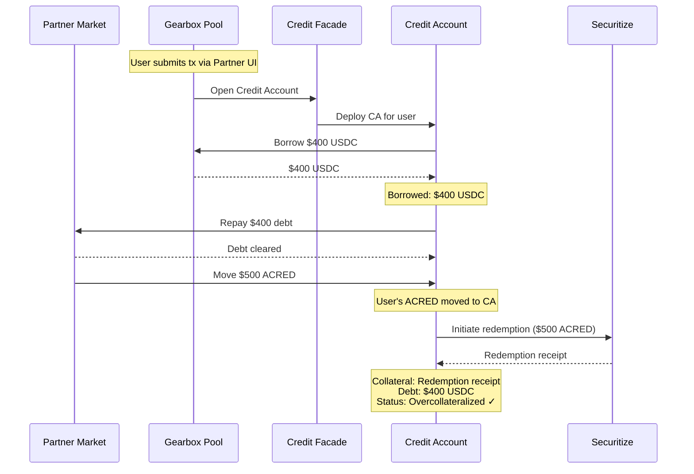

* **Credit Account deployed** for user (transparent, user doesn't interact directly)
* **Borrow $400 USDC** from Gearbox pool (capital provided by Partner Vault)
* **Repay Partner Market debt** with borrowed USDC
* **Move ACRED** to Credit Account
* **Initiate redemption** → Credit Account sends $500 ACRED to Securitize, receives redemption receipt
* **Position:** Redemption receipt (collateral) + $400 USDC debt
* **Overcollateralized** because Gearbox curator configured redemption receipt as valid collateral

**Result:** User has zero position on Partner Market, overcollateralized position on Gearbox (redemption receipt collateral, USDC debt)

**Phase 3: Waiting**

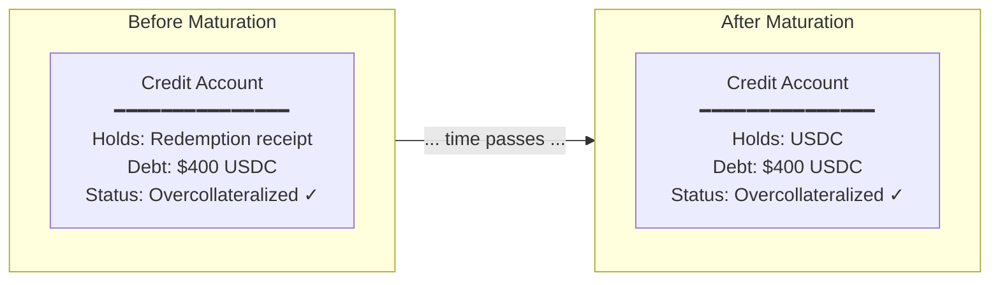

* Redemption window passes (hours to days depending on ACRED terms)
* Redemption receipt matures → USDC received
* Position still on Gearbox Credit Account

**Phase 4: Finalization & Close (Gearbox contracts)**

User triggers finalization (manual or auto-opt-in):

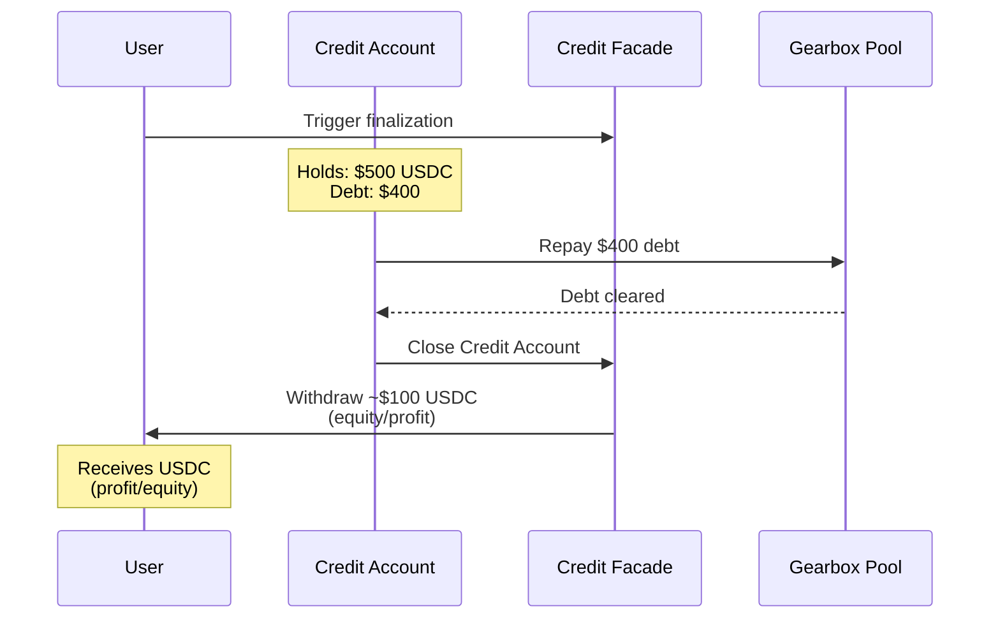

* **Repay $400 debt** to Gearbox pool
* **Close Credit Account**
* **User receives** \~$100 excess USDC (profit or remaining equity)

**Result:** Position fully closed. User has USDC in wallet.

***

#### Capital Flow Summary

**Where Capital Lives at Each Stage**

| Stage           | Capital Location | Reason                                      |
| --------------- | ---------------- | ------------------------------------------- |
| Entry Phase 2-3 | Gearbox Pool     | Position is in transition (pending deposit) |
| Entry Phase 4+  | Partner Market   | Position is mature ERC20                    |
| Exit Phase 1-2  | Gearbox Pool     | Position migrating for redemption           |
| Exit Phase 3    | Gearbox Pool     | Position in transition (redemption receipt) |
| Exit Phase 4    | N/A              | Position closed                             |
| After Exit      | Partner Market   | Available for new positions                 |

**Curator's Role in Capital Flow**

The curator actively manages liquidity allocation:

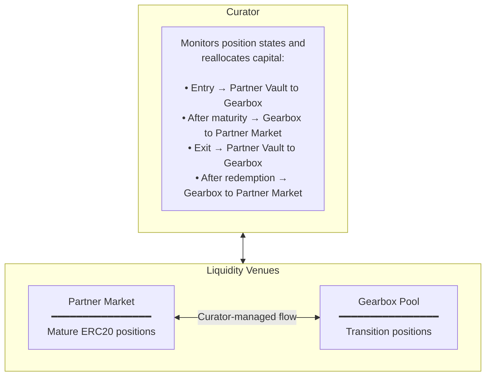

This can be done atomically within a single transaction (using flash loans if needed) or as separate operations depending on the curator's implementation.

***

#### Why This Works

**What Gearbox Enables**

| Capability                      | How It Helps                                                                                |
| ------------------------------- | ------------------------------------------------------------------------------------------- |
| **Transition-stage collateral** | Credit Accounts can hold pending-deposit tokens and redemption receipts as valid collateral |
| **Custom collateral valuation** | Curator sets different LTVs for pending vs mature states                                    |
| **Position metadata tracking**  | Credit Account knows deposit initiator, redemption timing, etc.                             |
| **Atomic solvency checks**      | Complex multi-step operations are valid if final state is overcollateralized                |

**Why Pool-Based Lenders Can't Do This Alone**

Pool-based lending protocols (Aave, Euler, Morpho) are optimized for standard ERC20 collateral:

* **No concept of transition states** — collateral is either an ERC20 or it isn't
* **Pooled positions** — can't track per-position metadata like deposit initiator
* **No custom collateral logic** — can't value pending deposits differently from mature tokens

Gearbox's Credit Account architecture provides the **per-position isolation and metadata** needed to safely collateralize transition-stage assets.
