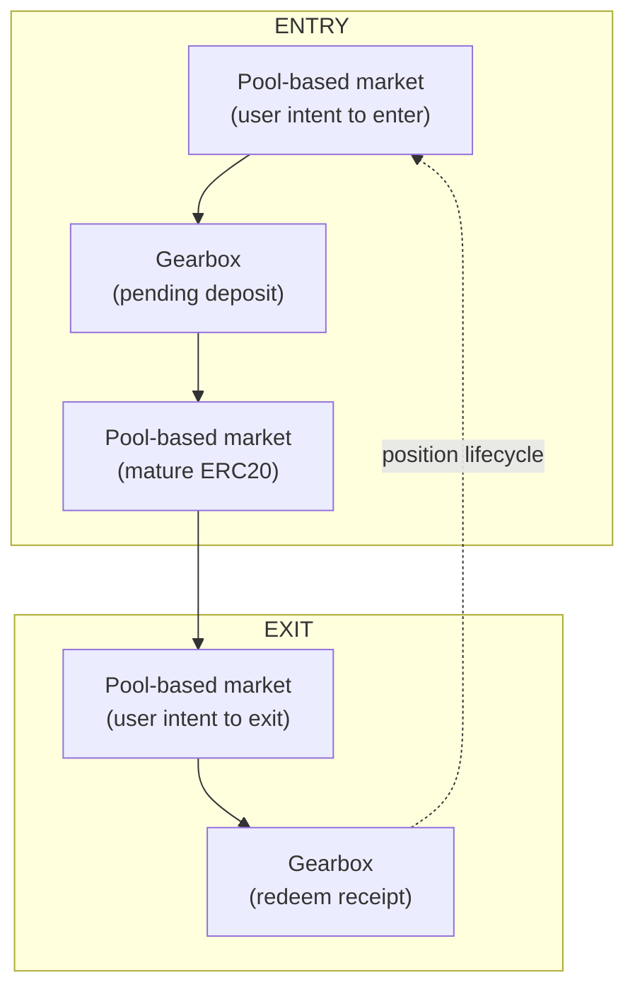
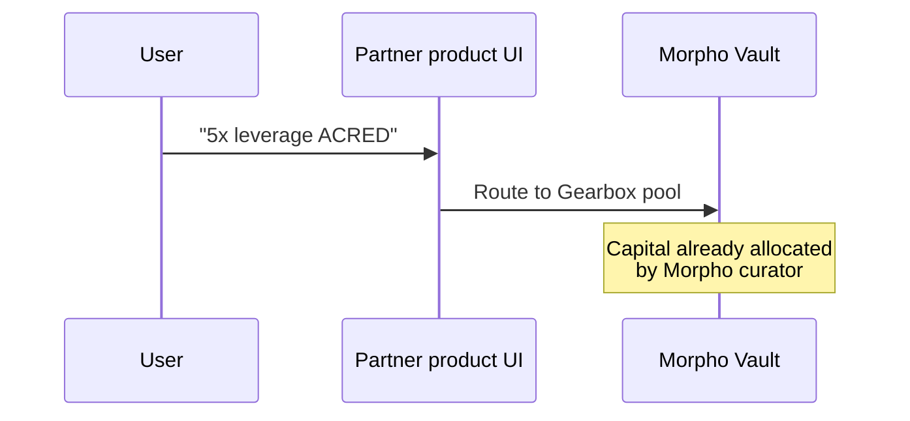
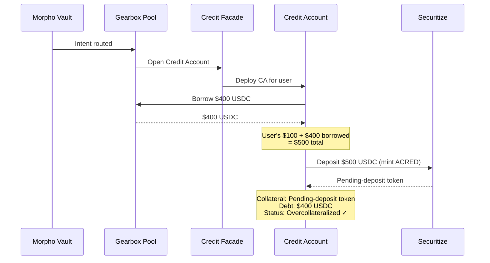
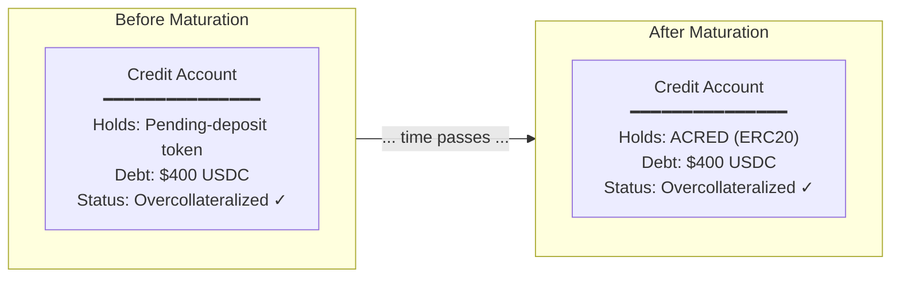
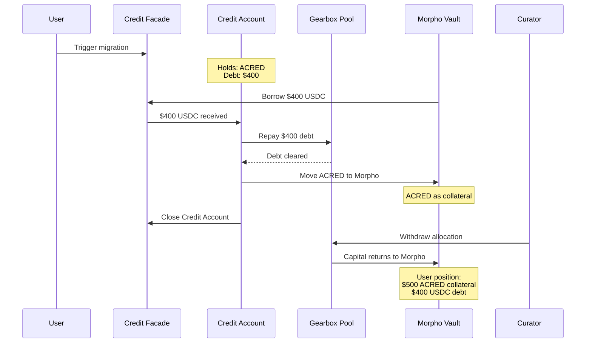
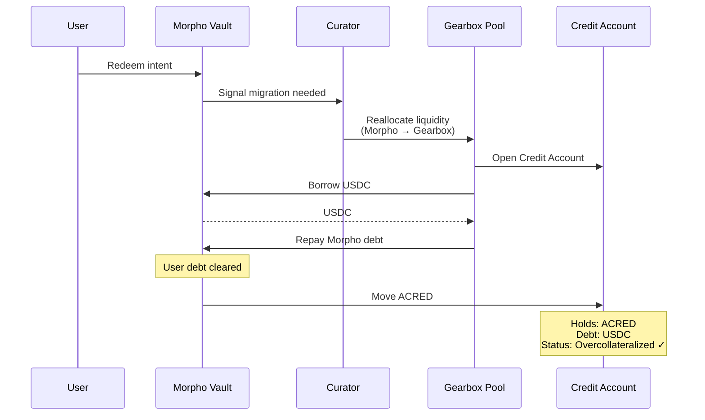
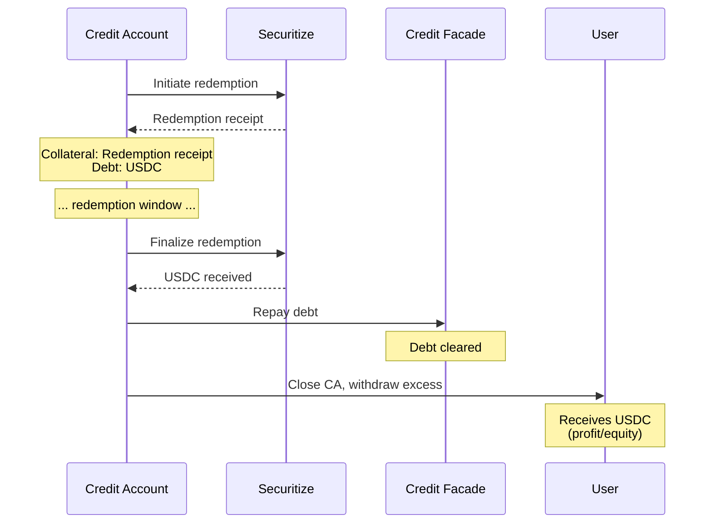
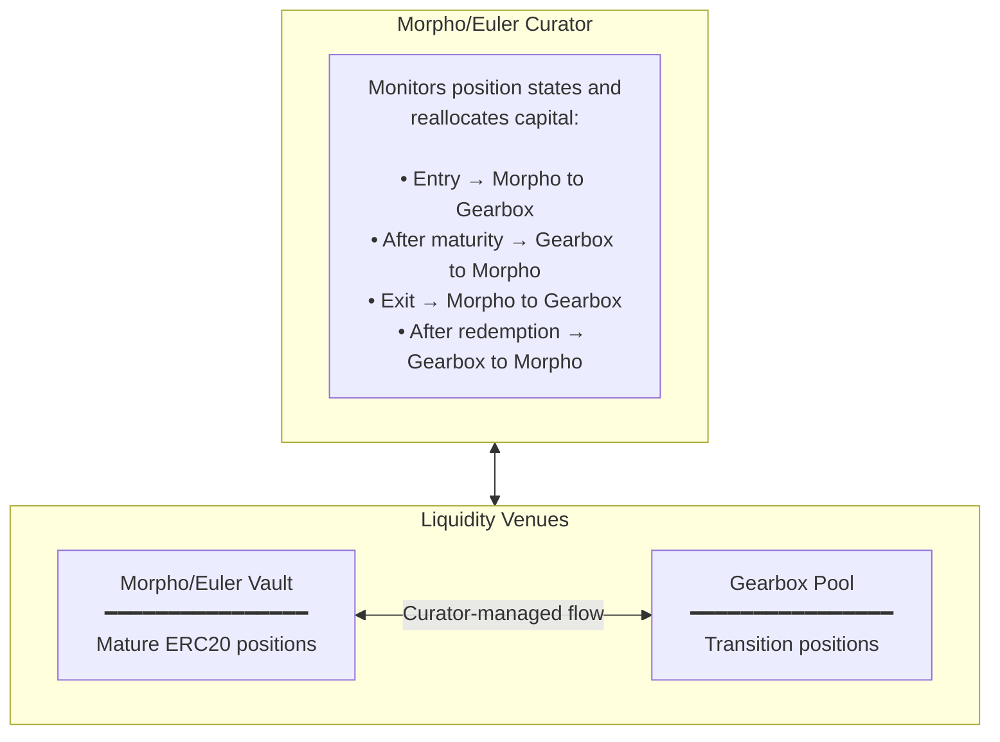
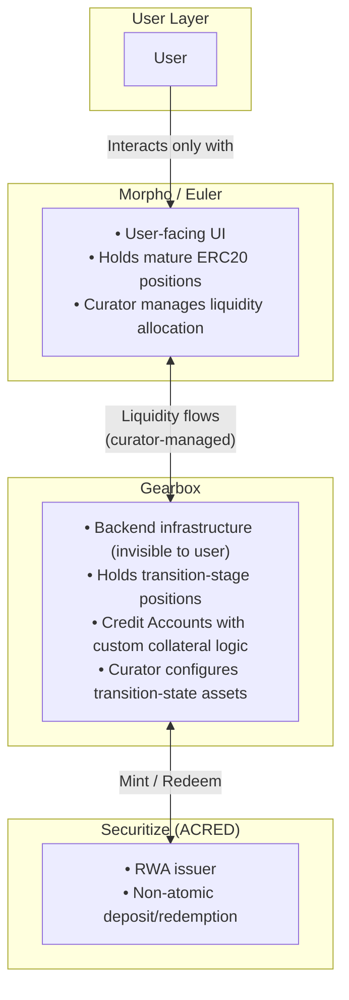

# Prime Brokerage for RWA Leverage

How Gearbox enables credit products to offer leveraged positions on assets with non-atomic settlement — using ACRED as an example.

***

### The Problem

RWAs like tokenized securities don't settle instantly. When you deposit USDC to mint ACRED, there's a delay before you receive the token. When you redeem ACRED, there's a delay before you get your USDC back.

This breaks traditional leverage flows:

**Traditional approach (flash loan style):**

1. User has $100, borrows $400 more in a flash loan
2. Swap $500 into asset
3. Deposit as collateral, receive leveraged position
4. All in one atomic transaction

**Why it fails for RWAs:**

* Step 2 doesn't work: you can't "swap" into an RWA — you must deposit and wait
* During the wait, you have no ERC20 collateral, just a pending-deposit claim
* It's technically hard to collateralize pending-deposit tokens, since those positions contain more data than a simple ERC20

**Result:** No leverage on RWAs with non-atomic settlement.

***

### The Solution: Gearbox as Transitional Venue

Gearbox acts as a **prime brokerage layer** that holds positions during transition phases — when assets are not yet standard ERC20s but pending deposits or redemption receipts.

**Key insight:** Gearbox holds the position when collateral is in a transition state. Pool-based market holds the position when collateral is a standard ERC20. Liquidity flows between them as the position matures.

The user interacts only with a preferred products' UIs. Gearbox is a backend infrastructure.

***

### Actors & Contracts

| Actor                         | Role                                                                                                                              | Contracts                                           |
| ----------------------------- | --------------------------------------------------------------------------------------------------------------------------------- | --------------------------------------------------- |
| **User**                      | Borrower taking leveraged position                                                                                                | User wallet                                         |
| **Pool-based market Curator** | Capital allocator. Manages liquidity allocation between Pool-based markets and Gearbox pool. Takes lending-side risk.             | Aave hub, Euler vault, Morpho vault                 |
| **Gearbox Curator**           | Configures collateral types including transition-stage assets. Sets risk parameters for pending deposits and redemption receipts. | Credit Configurator                                 |
| **Pool-based market**         | Lending infrastructure for mature ERC20 positions                                                                                 | Aave pool, Euler market, Morpho market              |
| **Gearbox**                   | Transitional venue. Holds positions during deposit/redemption windows.                                                            | Pool, Credit Manager, Credit Facade, Credit Account |
| **Securitize**                | ACRED issuer. Handles mint and redeem operations.                                                                                 | ACRED token, mint contract, redeem contract         |

#### Curator Relationship

Pool-based market curators and Gearbox curators are **formally different roles** but can be the same entity. A single party may:

* Configure the Morpho vault and allocate to Gearbox
* Configure the Gearbox market for transition-stage collateral

This alignment simplifies risk management and capital efficiency.

***

### One-Time Setup

Before users can take leveraged ACRED positions, curators configure both sides:

#### **Pool-based market** Curator

1. **Create vault/market** for ACRED leverage product
2. **Allocate capital** to ACRED market (exposed to ERC20 RWA itself)

#### Gearbox Curator

1. **Create Gearbox market** supporting ACRED in transition state as collateral
2. **Allocate capital to Gearbox market** when there is a user intent to enter/exit position

***

### Entry Flow: Taking 5x Leverage on ACRED

User wants $500 ACRED exposure with $100 own capital.

#### Phase 1: User Intent (Morpho contracts)

* User interacts with Morpho/Euler UI (familiar interface)
* Submits intent: "5x leverage on ACRED"
* Morpho routes intent to Gearbox pool (capital already allocated by curator)

#### Phase 2: Transition Setup (Gearbox contracts)

* **Credit Account deployed** for user (transparent, user doesn't interact directly)
* **Borrow $400 USDC** from Gearbox pool (capital provided by Morpho curator's allocation)
* **Deposit $500 USDC** to Securitize → receive pending-deposit token
* **Position:** Pending-deposit token (collateral) + $400 USDC debt
* **Overcollateralized** because Gearbox curator configured pending-deposit as valid collateral

#### Phase 3: Waiting

* Deposit window passes (hours to days depending on ACRED terms)
* Pending-deposit token becomes ACRED
* Position still on Gearbox Credit Account

#### Phase 4: Migration to Morpho (Morpho + Gearbox contracts)

User triggers migration (manual or auto-opt-in):

* **Borrow $400 USDC** from Morpho vault
* **Repay Gearbox debt** with borrowed USDC
* **Move ACRED** to Morpho as collateral
* **Close Credit Account**
* **Curator withdraws allocation** from Gearbox pool back to Morpho

**Result:** User has overcollateralized ACRED position on Morpho. $500 ACRED collateral, $400 USDC debt.

***

### Exit Flow: Redeeming ACRED Position

User wants to exit leveraged ACRED position and receive USDC.

#### Phase 1: Migration to Gearbox (Morpho + Gearbox contracts)

* **User signals redemption intent** on Morpho UI
* **Curator detects intent**, reallocates liquidity from Morpho → Gearbox (can be atomic in same tx, may involve flash loan)
* **Gearbox opens Credit Account** for user
* **Borrow from Gearbox** to repay Morpho debt
* **Move ACRED** to Credit Account

**Result:** User has zero position on Morpho, overcollateralized position on Gearbox (ACRED collateral, USDC debt)

#### Phase 2: Redemption (Gearbox + Securitize contracts)

* **Initiate redemption** → Credit Account sends ACRED to Securitize, receives redemption receipt
* **Position:** Redemption receipt (collateral) + USDC debt
* **Wait** for redemption window to pass
* **Finalize** → burn receipt, receive USDC
* **Repay debt**, close Credit Account
* **User receives** excess USDC (profit or remaining equity)

***

### Capital Flow Summary

#### Where Capital Lives at Each Stage

| Stage           | Capital Location        | Reason                                      |
| --------------- | ----------------------- | ------------------------------------------- |
| Entry Phase 2-3 | Gearbox Pool            | Position is in transition (pending deposit) |
| Entry Phase 4+  | Morpho/Euler Vault      | Position is mature ERC20                    |
| Exit Phase 1    | Gearbox Pool            | Position moving back for redemption         |
| Exit Phase 2    | Gearbox Pool            | Position in transition (redemption receipt) |
| After Exit      | Returns to Morpho/Euler | Available for new positions                 |

#### Curator's Role in Capital Flow

The Morpho/Euler curator actively manages liquidity allocation:

This can be done atomically within a single transaction (using flash loans if needed) or as separate operations depending on the curator's implementation.

***

### Why This Works

#### What Gearbox Enables

| Capability                      | How It Helps                                                                                |
| ------------------------------- | ------------------------------------------------------------------------------------------- |
| **Transition-stage collateral** | Credit Accounts can hold pending-deposit tokens and redemption receipts as valid collateral |
| **Custom collateral valuation** | Curator sets different LTVs for pending vs mature states                                    |
| **Position metadata tracking**  | Credit Account knows deposit initiator, redemption timing, etc.                             |
| **Atomic solvency checks**      | Complex multi-step operations are valid if final state is overcollateralized                |

#### Why Pool-Based Lenders Can't Do This Alone

Morpho and Euler are optimized for standard ERC20 collateral:

* **No concept of transition states** — collateral is either an ERC20 or it isn't
* **Pooled positions** — can't track per-position metadata like deposit initiator
* **No custom collateral logic** — can't value pending deposits differently from mature tokens

Gearbox's Credit Account architecture provides the **per-position isolation and metadata** needed to safely collateralize transition-stage assets.

***

### Summary: The Prime Brokerage Model

**Gearbox is the prime brokerage layer** that makes RWA leverage possible for pool-based lenders. It absorbs the complexity of transition-stage collateral, allowing Morpho and Euler to offer leveraged RWA products without modifying their core architecture.

Users get a familiar experience. Curators get capital efficiency. RWAs get leverage on day one.
