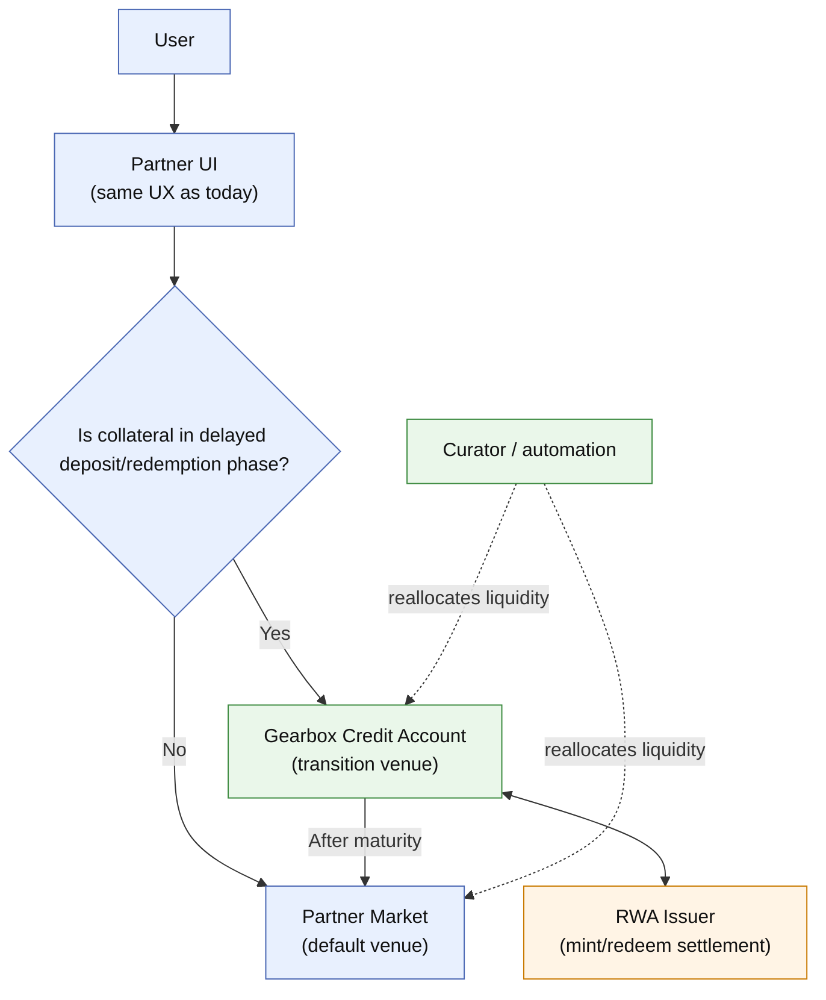
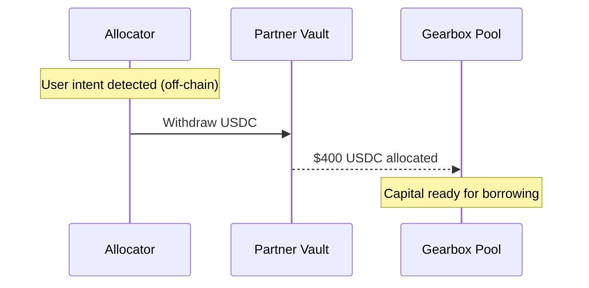
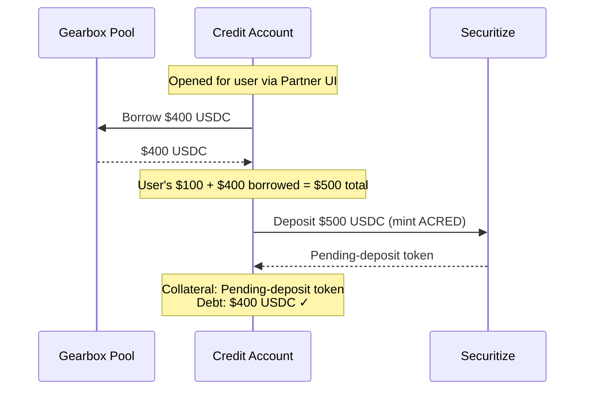
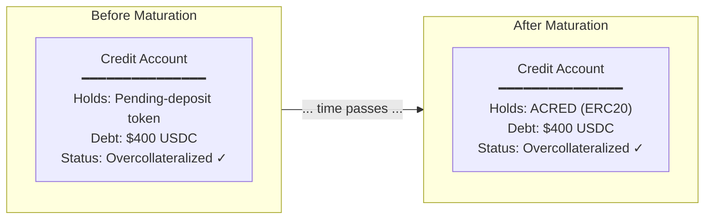
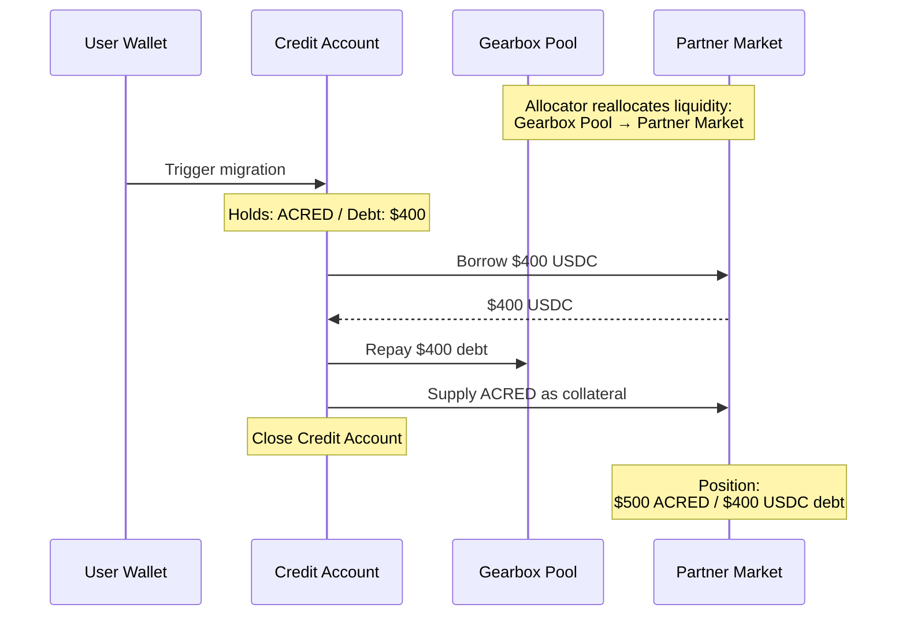
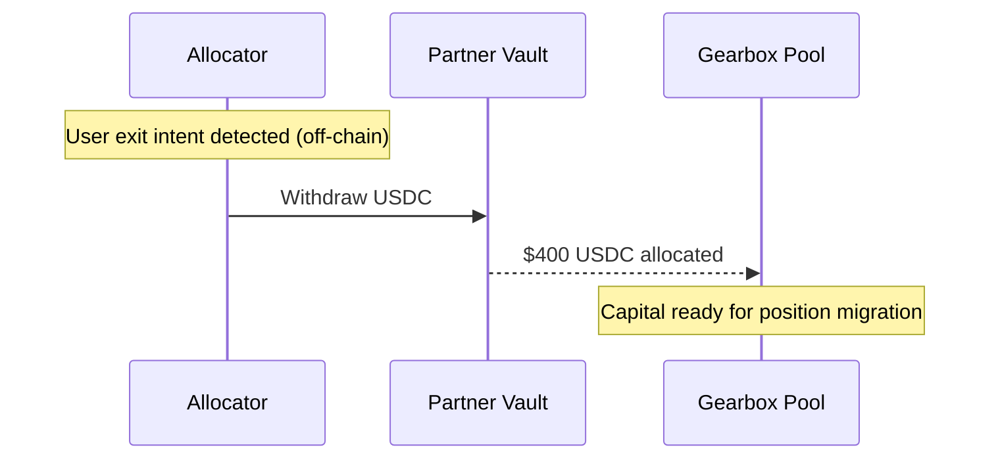
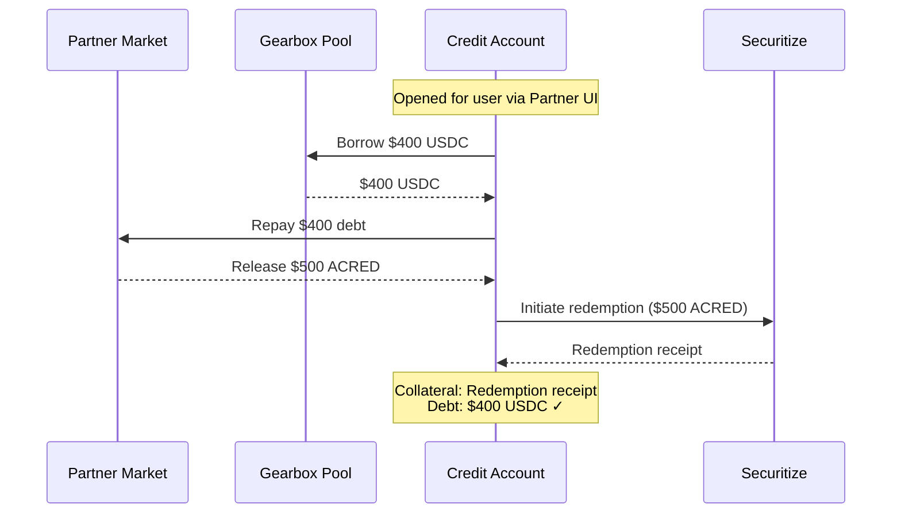
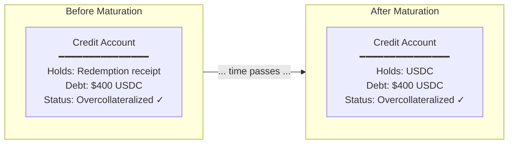
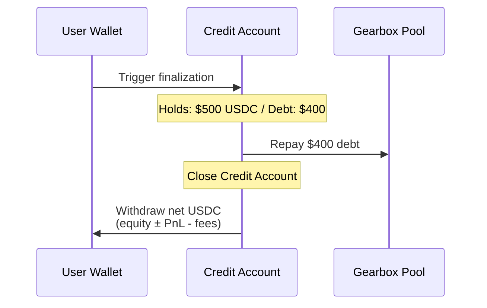
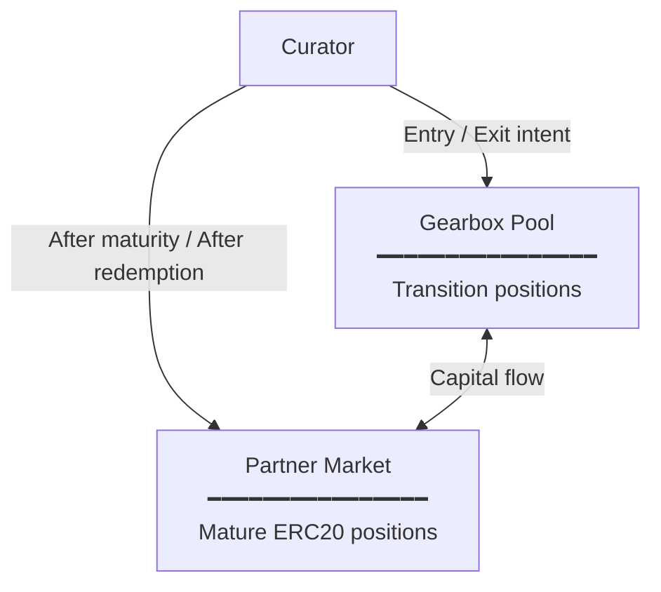

# Usecase: Faster RWA settlement with leverage

How Gearbox enables faster entry/exit for RWA-backed debt positions with non-atomic settlement, using ACRED leverage as an illustrative go-to-market use case.

***

### The Problem: Slow Settlement Breaks RWA-Backed Debt Positions

RWA tokens (tokenized securities, private credit, treasuries) typically do not settle atomically. Deposits (e.g., USDC → ACRED mint) can require hours or days, while redemptions can be materially longer (ACRED can be \~90 days).

This settlement profile constrains RWA-backed debt strategies (leverage is the clearest example):

* **Limited ability to react to market opportunities** — by the time a deposit matures, market conditions may have changed
* **Limited ability to exit during volatility** — positions can remain in redemption queues while prices move
* **Lower liquidator participation** — institutional liquidators are reluctant to warehouse long-dated redemption receipts (ACRED: \~90 days)

Traditional flash-loan style flows are insufficient because standard ERC20 collateral is unavailable during the waiting period.

***

### The Solution: Up to 10x Faster Entry/Exit for RWA-Backed Debt Positions

Gearbox acts as a **prime brokerage layer** that holds positions during transition phases — when assets are pending deposits or redemption receipts, not yet standard ERC20s.

**Result:** Platforms like Morpho, Euler, and Aave can support RWA-backed debt positions with materially faster entry/exit handling.

* **Time to open an RWA-backed debt position:** can be near-immediate (Hour 0), instead of waiting for mint completion.
* **Time to unwind credit position backed by RWA:** 1 redemption period, instead of iterative deleverage slowed by multi-day redemptions.

***

### Who Benefits

| User              | Current Problem                                                               | With Gearbox                                                            |
| ----------------- | ----------------------------------------------------------------------------- | ----------------------------------------------------------------------- |
| **Traders**       | Miss entry points during multi-day settlement                                 | Get an RWA-backed debt position immediately, then exit when appropriate |
| **Liquidators**   | Reluctant to take on long-dated redemption risk (ACRED can be \~90 days)      | Fast de-risking path (sell/finance receipt), reducing duration exposure |
| **Risk Curators** | Limited ability to offer fast credit products on RWAs with delayed settlement | Integration-ready infrastructure with no core protocol changes required |

***

### Exit Speed Comparison (ACRED Redemption)

* **Time to de-risk position exposure:** near-immediate with Gearbox vs \~90 days without&#x20;
* **Time to unwind leveraged position into stablecoins:** \~90 days with Gearbox vs  >240 days without


Gearbox improves liquidity and risk transfer during the waiting period; it does not shorten issuer redemption cycles


***

### How It Works: Prime Brokerage Model

Gearbox acts as a **prime brokerage layer** that holds positions during transition phases — when assets are not yet standard ERC20s but pending deposits or redemption receipts.

**What happens:**

* User interacts with familiar **Partner UI**
* **Partner Market** holds positions when collateral is mature ERC20
* **Gearbox** holds positions during transition (pending deposits, redemption receipts)
* **Curator** moves liquidity between Partner Market and Gearbox as positions mature

**Result:** Platforms like Morpho, Euler, and Aave can offer faster RWA-backed debt products without modifying their core architecture.

***

### Actors & Contracts

| Actor                      | Role                                                                                                                              | Contracts                                           |
| -------------------------- | --------------------------------------------------------------------------------------------------------------------------------- | --------------------------------------------------- |
| **User**                   | Borrower opening an RWA-backed debt position                                                                                      | User wallet                                         |
| **Partner Market Curator** | Capital allocator. Manages liquidity allocation between Partner vaults and Gearbox pool. Takes lending-side risk.                 | Aave hub, Morpho/Euler allocators                   |
| **Gearbox Curator**        | Configures collateral types including transition-stage assets. Sets risk parameters for pending deposits and redemption receipts. | Credit Configurator                                 |
| **Partner Market**         | Lending infrastructure for mature ERC20 positions                                                                                 | Aave pool, Morpho/Euler market                      |
| **Partner Vault**          | Liquidity source. Holds capital allocated by curators.                                                                            | Aave hub, Morpho/Euler vault                        |
| **Gearbox**                | Transitional venue. Holds positions during deposit/redemption windows.                                                            | Pool, Credit Manager, Credit Facade, Credit Account |
| **Securitize**             | ACRED issuer. Handles mint and redeem operations.                                                                                 | ACRED token, mint contract, redeem contract         |

#### Curator Relationship

Partner Market curators and Gearbox curators are **formally different roles** but can be the same entity. A single party may:

* Configure the Partner Vault and allocate to Gearbox
* Configure the Gearbox market for transition-stage collateral

This alignment simplifies risk management and capital efficiency.

***

### One-Time Setup

Before users can take RWA-backed debt positions using ACRED, curators configure both sides:

#### **Partner protocol**&#x20;

1. **Create vault/market** for ACRED credit product&#x20;
2. **Allocate capital** to ACRED market (exposed to ERC20 RWA itself)

#### Gearbox protocol

1. **Create Gearbox market** supporting ACRED in transition state as collateral
2. **Allocate capital to Gearbox market** when there is a user intent to enter/exit position

***

### Position Transfer Mechanism

When a position matures (pending-deposit → ACRED), it can be migrated from Gearbox to the Partner Market. Two approaches:

#### Why Migration Is Capital-Neutral

Migration between Gearbox and Partner Market does not require additional capital because both sides of the position move simultaneously:

* **Curator** controls supply-side allocation — moves liquidity between Gearbox Pool and Partner Market
* **User** (via Credit Account) controls debt + collateral — repays one venue, borrows from the other

When curator and user are coordinated (e.g., via smart contract integration or allocator contracts), supply and debt move together. The financial position stays exactly the same — same collateral, same debt, same health factor. Only the infrastructure changes.

This coordination can be implemented at the contract level, but the specifics are integration-dependent.

#### Partner Capability Checklist (Fill Per Integration)

| Partner Integration | Atomic supply+borrow+repay in one tx          | Native position handoff                 | Recommended Path                                                 |
| ------------------- | --------------------------------------------- | --------------------------------------- | ---------------------------------------------------------------- |
| Morpho deployment   | Verify per market + adapter                   | Verify per deployment                   | Option A if all checks pass, else Option B                       |
| Aave deployment     | Verify per pool version + integration wrapper | Typically requires wrapper/orchestrator | Option B by default, Option A if wrapper supports atomic handoff |
| Euler deployment    | Verify per vault design + adapter             | Verify per deployment                   | Option A if supported, else Option B                             |

***

### Entry Flow (Illustrative Use Case): Taking 5x Leverage on ACRED

User wants $500 ACRED exposure with $100 own capital.

#### Phase 1: User Intent

* User submits intent through Partner UI (off-chain)
* Allocator detects delayed deposit settlement
* Allocator moves capital from Partner Vault to Gearbox Pool
* Capital is now available for the Credit Account to borrow (next phase)

#### Phase 2: Transition Setup (Gearbox + Securitize contracts)

**Key Points:**

* **Credit Account is opened for the user** — user interaction remains at the Partner UI level
* User's $100 + borrowed $400 = $500 total position
* **Pending-deposit token is valid collateral** (curator-configured)
* Position remains overcollateralized during wait

#### Phase 3: Waiting

* Deposit window passes (hours to days depending on ACRED terms)
* Pending-deposit token becomes ACRED
* Position still on Gearbox Credit Account

#### Phase 4: Migration to Partner Market (Partner + Gearbox contracts)

User triggers migration (manual or auto-opt-in):

* **Allocator reallocates** liquidity from Gearbox Pool to Partner Market
* **Borrow $400 USDC** from Partner Market
* **Repay Gearbox debt** with borrowed USDC
* **Supply ACRED** to Partner Market as collateral
* **Close Credit Account**

**Result:** User has overcollateralized ACRED position on Partner Market. $500 ACRED collateral, $400 USDC debt. No additional capital is required — curator's supply-side reallocation and the user's debt migration happen together, so the financial position is unchanged (see [Position Transfer Mechanism](#position-transfer-mechanism)).

***

### Exit Flow: Redeeming ACRED Position

User wants to exit a $500 ACRED RWA-backed debt position ($100 equity, $400 debt) and receive USDC.

#### Why Exit Speed Matters

* **Liquidators avoid long-dated redemption risk** — ACRED redemption can be \~90 days
* **Near-immediate de-risking path enables more active liquidation participation**
* **Gearbox provides transition liquidity service** for liquidated positions

#### Phase 1: User Intent

* User submits exit intent through Partner UI (off-chain)
* Allocator detects delayed redemption settlement
* Allocator moves capital from Partner Vault to Gearbox Pool

#### Phase 2: Transition Setup (Gearbox + Securitize contracts)

* **Credit Account opened** for user (transparent; interaction remains at Partner UI layer)
* **Borrow $400 USDC** from Gearbox pool
* **Repay Partner Market debt** with borrowed USDC
* **Release ACRED** from Partner Market to Credit Account
* **Initiate redemption** → Credit Account sends $500 ACRED to Securitize, receives redemption receipt
* **Position:** Redemption receipt (collateral) + $400 USDC debt
* **Overcollateralized** because Gearbox curator configured redemption receipt as valid collateral

**Result:** User has zero position on Partner Market, overcollateralized position on Gearbox (redemption receipt collateral, USDC debt). As with entry migration, this is capital-neutral — supply and debt move together between venues.

#### Phase 3: Waiting

* Redemption window passes (ACRED can be long-dated, e.g., \~90 days; issuer-dependent)
* Redemption receipt matures → USDC received
* Position remains on Gearbox Credit Account until final settlement

#### Phase 4: Finalization & Close (Gearbox contracts)

User triggers finalization (manual or auto-opt-in):

* **Repay $400 debt** to Gearbox pool
* **Close Credit Account**
* **User receives** net USDC: redemption proceeds minus debt, interest, and fees (plus/minus PnL)

`Net user payout = redemption proceeds - repaid debt - accrued borrow interest - protocol fees ± position PnL`

**Result:** Position fully closed. User has USDC in wallet.

***

### Exit Value for Liquidators

Gearbox's speed advantage is most valuable during liquidations.

#### The Liquidator's Problem

When an RWA-backed debt position becomes undercollateralized:

1. Traditional approach: Liquidator takes position, initiates redemption, and often holds the receipt to settlement (ACRED: \~90 days)
2. Problem: Institutional liquidators are reluctant to hold long-dated redemption receipts through volatile periods
3. Result: **Lower liquidation participation can increase bad-debt risk**

#### The Gearbox Solution

1. Liquidator takes position in Credit Account
2. Redemption receipt is already there (or can be initiated immediately)
3. Liquidator can hold until redemption matures
4. **Or:** Gearbox curator can provide near-immediate liquidity by buying/financing the receipt at a discount

#### Value Proposition

| Metric                               | Traditional                                                | With Gearbox                                       |
| ------------------------------------ | ---------------------------------------------------------- | -------------------------------------------------- |
| Time to de-risk position exposure    | Often tied to full redemption window (\~90 days for ACRED) | Near-immediate if receipt is sold/financed         |
| Time to final issuer cash settlement | \~90 days (ACRED illustrative)                             | \~90 days (issuer-dependent; unchanged by Gearbox) |
| Liquidator risk                      | High (duration + market exposure)                          | Lower (faster de-risking path)                     |
| Protocol health                      | Lower liquidation participation, higher bad-debt risk      | More active liquidation participation              |

**Key insight:** The same mechanism that helps traders enter fast also helps liquidators de-risk faster, while final settlement remains issuer-timed. This makes the system healthier under stress.

***

### Capital Flow Summary

#### Where Capital Lives at Each Stage

| Stage           | Capital Location | Reason                                      |
| --------------- | ---------------- | ------------------------------------------- |
| Entry Phase 2-3 | Gearbox Pool     | Position is in transition (pending deposit) |
| Entry Phase 4+  | Partner Market   | Position is mature ERC20                    |
| Exit Phase 1-2  | Gearbox Pool     | Position migrating for redemption           |
| Exit Phase 3    | Gearbox Pool     | Position in transition (redemption receipt) |
| Exit Phase 4    | N/A              | Position closed                             |
| After Exit      | Partner Market   | Available for new positions                 |

#### Curator's Role in Capital Flow

The curator actively manages liquidity allocation:

This can be done atomically within a single transaction (using flash loans if needed) or as separate operations depending on the curator's implementation.

***

### Why This Works

#### What Gearbox Enables

| Capability                      | How It Helps                                                                                |
| ------------------------------- | ------------------------------------------------------------------------------------------- |
| **Transition-stage collateral** | Credit Accounts can hold pending-deposit tokens and redemption receipts as valid collateral |
| **Custom collateral valuation** | Curator sets different LTVs for pending vs mature states                                    |
| **Position metadata tracking**  | Credit Account knows deposit initiator, redemption timing, etc.                             |
| **Atomic solvency checks**      | Complex multi-step operations are valid if final state is overcollateralized                |

#### Why Pool-Based Lenders Alone Are Insufficient

Pool-based lending protocols (Aave, Euler, Morpho) are optimized for standard ERC20 collateral:

* **No native transition-state support** — collateral is treated as valid ERC20 collateral or invalid
* **Pooled position design** — these systems cannot track per-position metadata (e.g., deposit initiator)
* **No custom transition-stage valuation logic** — pending deposits and mature tokens cannot be risk-modeled differently by position

Gearbox Credit Account architecture provides the **per-position isolation and metadata** required to collateralize transition-stage assets safely.

***

### Pricing Considerations

> **Note:** Pricing should be validated with target users. This section poses questions, not answers.

#### Questions to Answer

1. What are the alternatives for fast RWA-backed debt positioning? (TradFi, other DeFi protocols)
2. What is the time value of faster entry/exit for hedge funds?
3. What would users pay for instant liquidity during market stress?

#### Market Comparison

| Platform               | Fee     | Notes                            |
| ---------------------- | ------- | -------------------------------- |
| Uniswap (v2)           | 0.3%    | Set when no alternatives existed |
| Uniswap (v3)           | 0.01-1% | Variable, depends on pair        |
| Aave flash loan        | 0.09%   | For atomic operations            |
| **Gearbox (proposed)** | **?**   | Depends on value delivered       |

#### Transcript Note

> "0.05% seems too low. Uniswap was 0.3% when they had no competition."

**Recommendation:** Research target users (hedge funds, professional traders) on willingness to pay. Consider 0.3-1% range based on Uniswap precedent.

***

### Frequently Asked Questions

#### Can Morpho build this natively?

Yes, but position transfer mechanics are complex. Gearbox provides tested infrastructure with phantom token support. Building in-house requires:

* Phantom token contract
* Position transfer logic
* Safety checks for automated migration

Gearbox offers this as a service, enabling shorter time-to-market and reduced audit scope.

#### Is this limited to Morpho?

No. It applies to Aave, Euler, and other lending markets. Gearbox is infrastructure that any risk curator can integrate.

#### What happens if price drops during deposit window?

Overcollateralization depends on configured haircuts and thresholds. Pending-deposit collateral is typically valued conservatively; liquidation can still occur if health factor falls below the configured limit.

#### How much capital does the curator need?

Depends on expected user demand. Curator allocates capital from their vault to Gearbox pool when users signal intent. Capital efficiency improves as positions mature and migrate to partner markets.

#### Who are the liquidators?

Professional market makers and funds. They value fast de-risking capability and generally avoid holding long-dated redemption receipts (ACRED can be \~120 days) during market stress.
