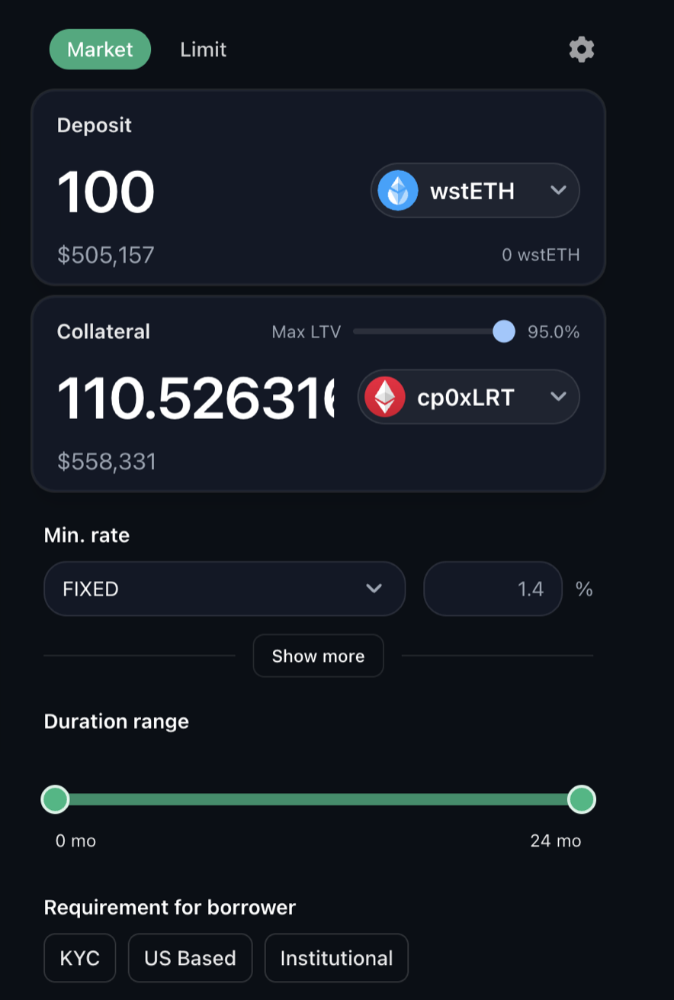
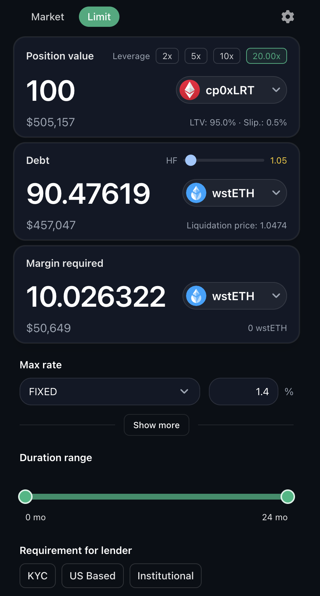
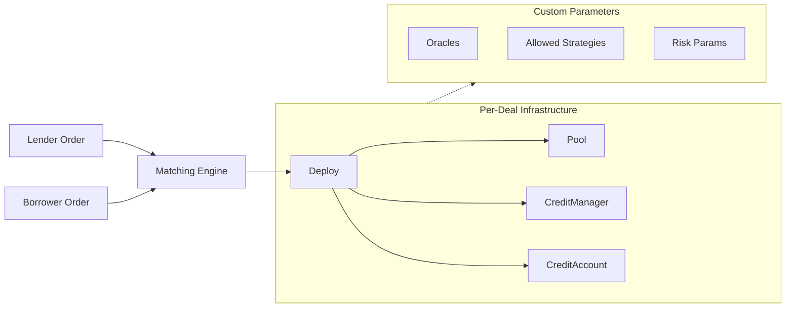

# Usecase: Intent-based lending

### The Problem

DeFi lending looks liquid, but behaves like a black box.

**Your capital goes into a vault.** Rates move unpredictably. Risks get pooled. When something breaks: MEV, liquidations, curator mistakes — losses are socialized. You find out the hard way it was never really your money.

**For regulated institutions, it gets worse:** comingled funds, unknown counterparties, no audit trail. Most compliance frameworks require counterparty identification and fund segregation. Pooled DeFi offers neither.

_Legacy finance offers bespoke terms, but with counterparty risk, settlement delays, and opaque execution._

***

### The Solution

**Post your terms. Match with counterparties. Execute on-chain.**

You don't "deposit." You define:

* Asset, size, duration
* Rate: fixed (5% APY) or reference-based (LIBOR + 2%, Aave + 3%)
* Accepted collateral and strategies
* Compliance requirements

Your order is signed and immutable. No curator can change it. No protocol upgrade can rewrite it.

When a counterparty matches your terms, the contract executes. Until then, your capital stays productive where it already is.

**You own the terms. You own the risk. You own the exit.**

***

### How It Works

<table><thead><tr><th width="40"></th><th>Step</th></tr></thead><tbody><tr><td>1️⃣</td><td><strong>Post</strong> — Define exact terms: rate, collateral, duration, compliance gates. Sign immutably.</td></tr><tr><td>2️⃣</td><td><strong>Match</strong> — Engine pairs compatible orders with counterparty verification. No gatekeepers.</td></tr><tr><td>3️⃣</td><td><strong>Execute</strong> — Isolated pool + credit account deployed with your exact parameters.</td></tr><tr><td>4️⃣</td><td><strong>Exit</strong> — Sell position on secondary market anytime, or wait for maturity.</td></tr></tbody></table>

No idle capital. No comingled funds. No curator risk.

***

### Why Gearbox

<table><thead><tr><th width="40"></th><th width="233.4765625">Capability</th><th>Benefit</th></tr></thead><tbody><tr><td>🎯</td><td><strong>Predictable Rates</strong></td><td>
Fixed or reference-based (LIBOR, Aave). 

You define the formula: no utilization roulette.
</td></tr><tr><td>🔗</td><td><strong>Controlled Composability</strong></td><td>Lender defines allowed strategies. Borrower executes within boundaries: transparent, on-chain enforced.</td></tr><tr><td>🏦</td><td><strong>Custom Collateral</strong></td><td>
Tokenized equities, private credit, real estate. 

Each deal: own oracle, own risk params.
</td></tr><tr><td>🔄</td><td><strong>Secondary Market</strong></td><td>
Sell active positions anytime. 

Turn illiquid terms into liquid exits.
</td></tr><tr><td>🔒</td><td><strong>No Curator Risk</strong></td><td>
Once matched, the contract is final. 

No vault-level loss sharing. No surprises.
</td></tr><tr><td>📋</td><td><strong>Regulatory Alignment</strong></td><td>No comingled funds, clear audit trails, counterparty-specific compliance.</td></tr></tbody></table>

***

### Regulatory Alignment

Traditional DeFi pools create compliance barriers. Intent-based lending solves them:

<table><thead><tr><th width="40"></th><th width="229.00390625">Requirement</th><th>✅ Solution</th></tr></thead><tbody><tr><td>👤</td><td><strong>Know Your Counterparty</strong></td><td>Direct matching. No anonymous participants.</td></tr><tr><td>🔒</td><td><strong>No Comingling</strong></td><td>Isolated infrastructure per deal. Capital never mixes.</td></tr><tr><td>📝</td><td><strong>Audit Trail</strong></td><td>On-chain record: who, what, when, all transactions.</td></tr><tr><td>✓</td><td><strong>Compliance Gates</strong></td><td>Per-deal KYC/AML, jurisdiction, accreditation checks.</td></tr><tr><td>🛡️</td><td><strong>Risk Segregation</strong></td><td>One default doesn't cascade to other positions.</td></tr></tbody></table>

This structure aligns with emerging regulatory frameworks for institutional DeFi participation.

***

### RWA Collateral

<table><thead><tr><th width="40"></th><th width="233.5546875">Collateral Type</th><th>Example</th></tr></thead><tbody><tr><td>📈</td><td>Tokenized Securities</td><td>Borrow USDC against S&#x26;P 500 ETF tokens</td></tr><tr><td>💼</td><td>Private Credit</td><td>Collateralize with tokenized loan tranches</td></tr><tr><td>🏠</td><td>Real Estate</td><td>Borrow against tokenized property</td></tr><tr><td>🏛️</td><td>T-Bills</td><td>Treasury tokens as pristine collateral</td></tr></tbody></table>

Custom price feeds, LTV ratios, liquidation parameters—negotiated per intent.

***

### Capital Efficiency

<table><thead><tr><th width="122.17578125"></th><th width="245.66015625">Traditional Pool</th><th>Intent-Based</th></tr></thead><tbody><tr><td>💰 Capital</td><td>❌ Locked on deposit</td><td>✅ Productive until match</td></tr><tr><td>📊 Rates</td><td>❌ Utilization-driven volatility</td><td>✅ Defined formula (fixed or reference-based)</td></tr><tr><td>🏦 Collateral</td><td>❌ Single profile</td><td>✅ Custom per agreement</td></tr><tr><td>⚠️ Risk</td><td>❌ Socialized losses</td><td>✅ Isolated per deal</td></tr><tr><td>🚪 Exit</td><td>❌ Wait for utilization</td><td>✅ Secondary market anytime</td></tr></tbody></table>

***

### Product Preview

Both sides define their exact terms: asset, rate (fixed or reference-based), duration, LTV, and counterparty compliance requirements (KYC, jurisdiction, institutional status).

| Lender View                                          | Borrower View                                          |
| ---------------------------------------------------- | ------------------------------------------------------ |
|  |  |

### Technical Architecture

Gearbox's modular architecture enables per-agreement deployment without protocol changes.

***

### Next Step

Interested in institutional-grade DeFi lending with predictable rates, custom collateral, and compliance controls?

**Contact the Gearbox team** to discuss pilot programs for intent-based credit markets.
