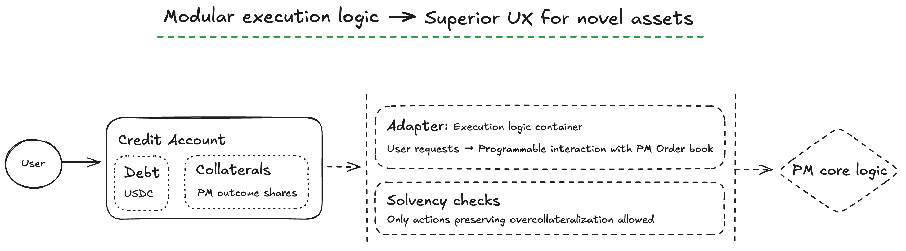

# Credit for Prediction Markets

Prediction-market shares remain an untapped opportunity for credit due to their unique mechanics, collateral behavior, and the need for optimized risk frameworks.&#x20;

Gearbox is built to support such novel use cases by design: Credit Accounts enable modular configuration of execution rules, while Lending Market parameters can be flexibly adjusted to meet evolving market needs.

## Modular execution rules

Gearbox’s modular architecture unifies credit and execution, allowing custom logic to run directly within leveraged positions.&#x20;

The core money-market layer provides additional capital while ensuring positions remain fully collateralized, and specialized modules extend this base with any purpose-specific execution rules.

<figure><figcaption></figcaption></figure>

## Flexible Risk Controls

Prediction-market outcome shares require additional risk oversight due to their unique behavior, such as sharp price movements near resolution.&#x20;

Gearbox’s risk framework is built to operate under uncertainty and adapt to market conditions that may not have been seen before.

#### **Key challenges with prediction-market dynamics:**

**Shallow liquidity:** Vulnerable to short-term price manipulation and arbitrage, though prices tend to stabilize over the medium term.

**High volatility near resolution:** Makes pricing and liquidations significantly more difficult.

#### **Gearbox provides a robust set of tools to address these challenges:**

**Dual-oracle system**

* Protects against short-term manipulation by cross-checking with an alternative source (e.g., a longer TWAP).
* The primary oracle handles solvency checks and triggers liquidations.
* The secondary oracle detects divergence and blocks sensitive operations when prices disagree.

**LT ramping**

* Gradually reduce exposure as markets approach maturity.
* Adjustable slope and duration ensure borrowers deleverage in time, protecting LPs.

**Loss policy**

* Adds protective logic for liquidations that could create bad debt.
* Prevents liquidation cascades and defends LPs against manipulation-driven loss scenarios.


**If you’re building credit for prediction markets, reach out to Gearbox for the infrastructure so you can focus on product.**

