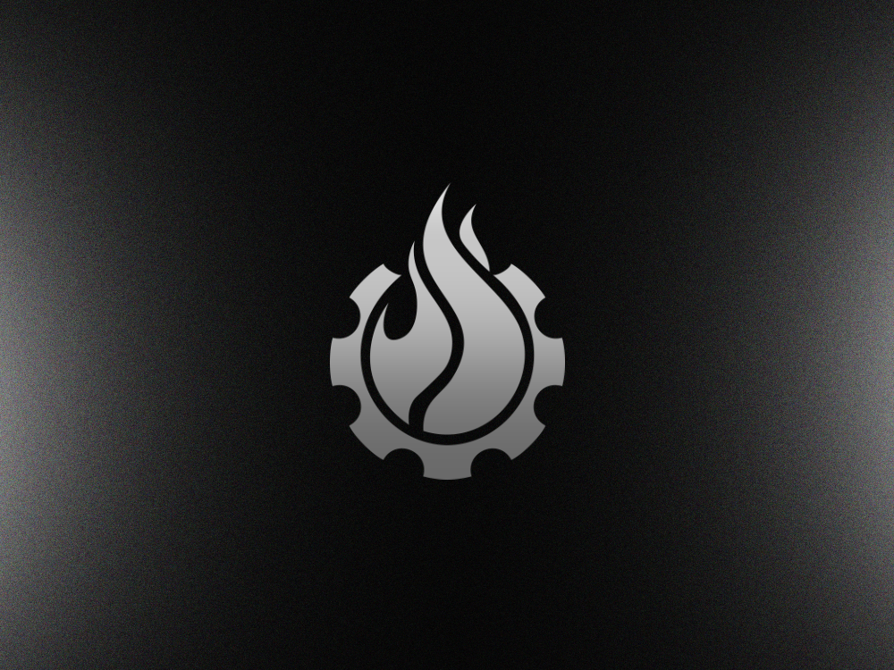

# Gearbox Permissionless for Curators

Gearbox Permissionless provides the operational rails for institutions, asset managers, and fintechs to deploy onchain credit markets.

**Curator**, acts as the operator of a standalone lending vertical. This role is designed for entities seeking to retain full ownership of their market's risk parameters and economic model, while leveraging Gearbox’s battle-tested settlement engine to handle execution, solvency, and compliance.

This page outlines the operational model and strategic advantages of the Gearbox curation stack.

## Market Curation, Not Fund Management

In many onchain lending models, curation requires active capital reallocation, manually moving funds between vaults to chase yield. This creates significant operational burden and can inadvertently classify operators as financial intermediaries or asset managers.

**The Gearbox Approach:**\
Curators manage **Parameters**, not **Funds**.

* **Non-Custodial:** Curator defines the rules (LTVs, Interest Rate Models), but never possesses or controls user funds.
* **Automated Execution:** The protocol automatically allows credit usage within allowed limits and enforces solvency based on pre-defined logic.
* **Compliance Benefit:** This passive model allows you to operate a lending business without engaging in active fund management activities.

## Structured Credit Products

Standard lending markets are commoditized, offering simple borrowing against collateral. Gearbox enables Curators to structure complex **Credit Products**.

* **Strategy Integration:** Deploy markets that offer native access to specific yield strategies (e.g., Leveraged Staking, Basis Trading, or RWA accumulation).
* **Capital Efficiency:** By integrating execution directly into the credit account, Curators can offer higher leverage ratios with tighter risk controls than standard over-collateralized lending.

## Institutional-Grade Risk Framework

For asset issuers and fund managers, security is the primary constraint. Gearbox provides a multi-layered safety stack designed for high-value deployments.

* **Dual-Oracle Architecture:** Markets utilize a primary and secondary oracle source to prevent price manipulation and ensure accurate mark-to-market valuations.
* **Automated Insolvency Resolution:** The "Loss Policy" mechanism provides pre-defined logic for handling bad debt events, protecting Liquidity Providers from black swan scenarios.
* **Granular Access Control:** Curators can deploy permissioned instances, utilizing allowlists for borrowers or lenders to meet KYC/AML requirements.


_**If you’re expanding your product offering, reach out to Gearbox to power your lending vertical with superior UX and a safety-first design.**_




<figure><figcaption></figcaption></figure>



#### Get started

Create a market and make first steps towards launching a lending product.

<a href="https://app.gitbook.com/s/pcj4vgsOuQfPmnWXPHll/curation-step-by-step/create-a-new-curator-market-configurator" class="button primary" data-icon="rocket-launch">Become a Market Curator</a>



## Learn in details

<table data-view="cards"><thead><tr><th></th><th data-hidden data-card-cover data-type="image">Cover image</th><th data-hidden data-card-target data-type="content-ref"></th></tr></thead><tbody><tr><td><h4>Collateral-specific rates</h4>
Non-custodial by design. Capital-efficient by default
</td><td><a href="../.gitbook/assets/gearboxdocsmain.png">gearboxdocsmain.png</a></td><td><a href="/broken/spaces/viVygst6ymEvrLTl74w1/pages/lIB5iXcS2cNayIORZTYY">Broken link</a></td></tr><tr><td><h4>Dual-oracle system &#x26; bad debt prevention</h4>
A safety-first mechanisms for LP protection
</td><td><a href="../.gitbook/assets/gearboxdocscurate.png">gearboxdocscurate.png</a></td><td><a href="https://app.gitbook.com/s/viVygst6ymEvrLTl74w1/economics-and-risk/smart-oracles">Smart Oracles</a></td></tr><tr><td><h4>Multichain Scaling</h4>
Grow across ecosystems with ready-to-use infrastructure
</td><td><a href="../.gitbook/assets/gearboxdocsborrow.png">gearboxdocsborrow.png</a></td><td><a href="https://app.gitbook.com/s/viVygst6ymEvrLTl74w1/introduction/omni-evm-architecture">Omni-EVM Architecture</a></td></tr><tr><td><h4>Native integrations for superior UX</h4>
Offer users best-in-class capital-efficiency
</td><td><a href="../.gitbook/assets/gearboxdocuses.png">gearboxdocuses.png</a></td><td><a href="/broken/spaces/viVygst6ymEvrLTl74w1/pages/ZdrtOX1TEvQlKJMbXtO0">Broken link</a></td></tr></tbody></table>
